# Lab 1: WXO Agent Governance - Credit Card Advisor Agent with RAG and Quotation Tool

## Table of Contents
- [Architecture](#architecture)
- [Use Case Description](#use-case-description)
- [Pre-requisites](#pre-requisites)
- [Step-by-Step Instructions](#step-by-step-instructions)
  - [Part 1: Create the Product Agent in watsonx Orchestrate](#part-1-create-the-product-agent-in-watsonx-orchestrate)
  - [Part 2: Add Knowledge Base (RAG)](#part-2-add-knowledge-base-rag)
  - [Part 3: Import the Quotation Tool](#part-3-import-the-quotation-tool)
  - [Part 4: Pre-production Agent Testing](#part-4-pre-production-agent-testing)
  - [Part 5: Production agent monitoring](#part-5-production-agent-monitoring)

## Architecture

*Architecture diagram will be added here.*

## Use Case Description

The sales department of a major Canadian financial institution needed a smarter way to handle credit card product inquiries and comparisons. This lab builds an AI-powered Credit Card Product Agent that:
1. **Uses RAG**: Instead of delegating to an external comparison agent, we use Retrieval-Augmented Generation (RAG) with the credit card product catalog to answer product queries and perform comparisons.

2. **Adding Quotation Capabilities**: Integrating a custom quotation tool that calculates credit card recommendations based on card type, province, credit limit, and rewards preferences.

This approach demonstrates:
- Knowledge base integration for product information
- Custom tool integration
- Agent evaluation and production monitoring


## Pre-requisites

- Access to IBM watsonx Orchestrate instance
- Familiarity with AI agent concepts (instructions, tools, knowledge bases)
- Basic understanding of REST APIs and OpenAPI specifications
- Files provided by instructor:
  - `Canadian_Bank_Credit_Card_Product_Catalog_v2.pdf`

## Step-by-Step Instructions

### Part 1: Create the Product Agent in watsonx Orchestrate

#### 1.1 Access watsonx Orchestrate

1. Go to IBM Cloud (https://cloud.ibm.com) and ensure you're in the correct account

2. Navigate to **Resource list** → **AI / Machine Learning** → **watsonx Orchestrate**

3. Click **Launch watsonx Orchestrate**

4. Click the hamburger menu (☰) and select **Build**

   

#### 1.2 Create the Agent

1. Click **Create agent +**

   

2. Select **Create from scratch**

3. Enter the following details:
   - **Name**: `Product Agent-<your-initials>` Please provide a unique name by adding your initials to the name.
   - **Description**:
     ```
     This agent is designed to search for Canadian Bank credit card products and retrieve their details and features using Retrieval-Augmented Generation (RAG) on the product catalog. It can also perform product comparisons and generate credit card recommendations based on spending habits, province, credit limit, rewards preferences, and financial needs.
     ```

4. Click **Create**

   

### Part 2: Add Knowledge Base (RAG)

#### 2.1 Upload Product Catalog

1. Scroll down to the **Knowledge** section

2. Click **Add Source** → **New Knowledge**

   

3. Select **Upload Files** → Click **Next**

   

4. Download `Canadian_Bank_Credit_Card_Product_Catalog_v2.pdf` from the Lab 5 folder

5. Drag and drop the file into the upload area

   

6. Click **Next** after upload completes

   

#### 2.2 Configure Knowledge Base

1. **Name**: `Credit-products`

2. **Description**:
   ```
   Your knowledge base is the document that contains all the Canadian Bank credit card product-related information and competitor's product information. All queries related to the credit card products will be addressed using this document as the primary source. This document will be used to answer questions related to Canadian Bank credit card products.
   ```

3. Click **Save**

   

4. Verify the knowledge source appears in the Knowledge section

   

5. Click the **Edit details** button

   

6. Click Edit knowledge settings

   

7. Choose Dynamic, edit the Maximum Search Results to 10 and click **Save**

   

8. Click the agent name on the top to go back to agent builder

   

### Part 3: Import the Quotation Tool

#### 3.1 Import Tool via UI

1. Scroll down to the **Toolset** section in your agent configuration

2. Click **Add tool +**

   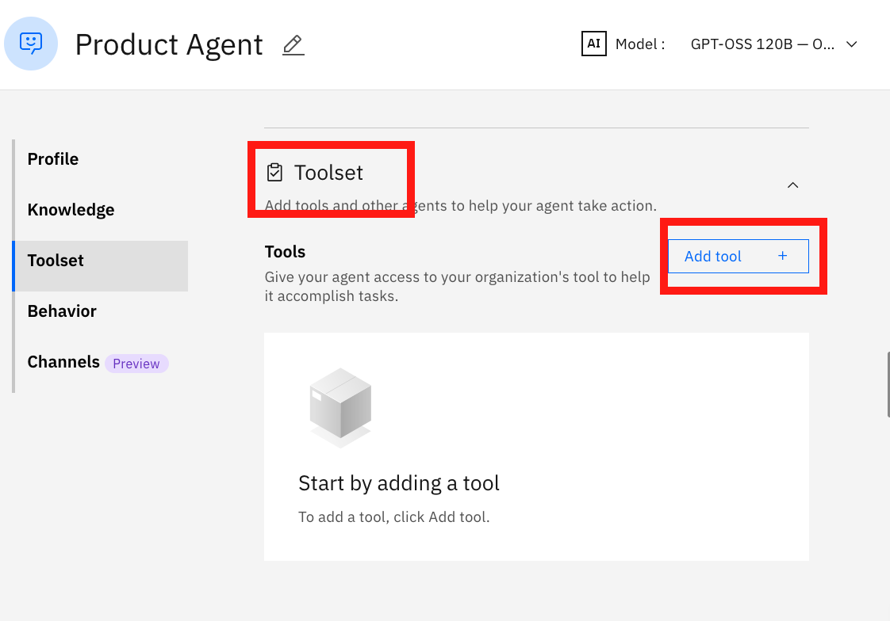

3. Select **Import** → **OpenAPI**

   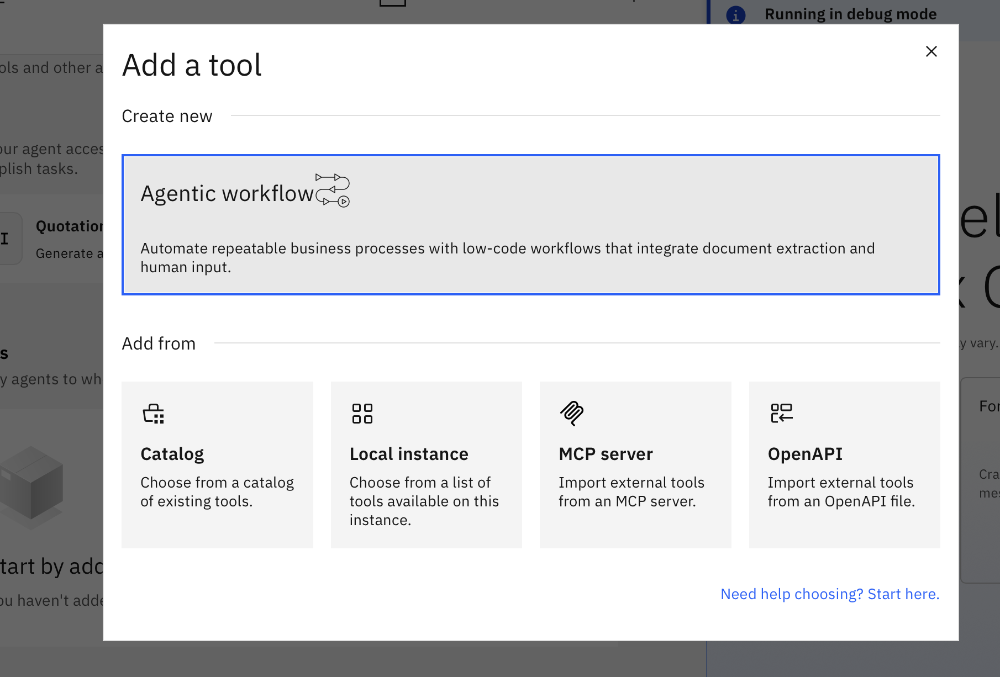

4. Upload the product_tool.json file that is provided to you Select **Recommendation tool** and click **Add to agent**

   

5. Verify the tool appears in the Toolset section

   

#### 3.2 Configure Agent Behavior

Scroll down to the **Behavior** section and add the following instructions:

   

   ```
You are an expert Canadian Bank credit card product and information assistant. You operate exclusively within the financial services domain and use available context to provide accurate, detailed responses.

Core Responsibilities:

1. Product Information & Knowledge Base
When users ask questions about Canadian Bank credit cards, retrieve answers from the Canadian-Bank-products knowledge base. Provide comprehensive details about card features, rewards, fees, and benefits.

2. Product Comparison Analysis
When users request product comparisons:

Card Type Matching:
- Identify the card category of the specified product (Travel Rewards, Cash Back, No Fee, Premium)
- ONLY compare cards of the SAME category (Travel vs Travel, Cash Back vs Cash Back, etc.)
- Cross-category comparisons are strictly prohibited
- If no valid same-category competitors exist, state: "No valid same-category competitors found."

Comparison Features:
Analyze and compare products on these features ONLY:
- Annual Fee
- Rewards Rate
- Welcome Bonus
- Interest Rate
- Travel Benefits
- Insurance Coverage
- Mark as "N/A" if feature is not applicable

Presentation Format:
Present analysis in exactly three tables with two dividers after each:

Table 1: Feature Comparison
- Products as column headers
- Feature rows with detailed specifications

Table 2: Rating Comparison
- One column per product
- Format: X/5 ★★★★☆ (no commas, parentheses, or extra symbols)

Table 3: SWOT Analysis
- Strengths, Weaknesses, Opportunities, Threats for top products

Competitors Section:
When asked for competitors, provide:
- Product names with URLs directly below each name
- URLs must be from financial services industry only
- Section title: Competitors

Standards:
- All fees and pricing in Canadian Dollars (CAD)
- All interest rates as annual percentage rates (APR)
- Products as column names in all tables
- Appropriate spacing between table sections

3. Credit Card Recommendations & Pricing
When customers ask about credit card fees, monthly costs, or recommendations, use the quotation_tool to calculate accurate quotes.

Required Parameters:
- card: Maple Rewards Visa Infinite, Maple Cash Back Mastercard, Maple Travel Elite Visa, or Maple No-Fee Everyday Mastercard
- intent: new card, balance transfer, or credit limit increase
- province: Canadian province code (ON, QC, BC, AB, MB, SK, NS, NB, PE, NL)
- credit_limit: requested credit limit amount in CAD
- rewards_preference: cash back, travel points, or no fee

Recommendation Response Format:
Always present results in a markdown table format showing:
- Annual fee (in CAD)
- Monthly fee (in CAD)
- Total annual cost (in CAD)
- Card description
- Recommendation summary

Example format:
| Detail | Value |
|--------|-------|
| Card | Maple Rewards Visa Infinite |
| Intent | New Card |
| Province | ON |
| Credit Limit | $10,000.00 CAD |
| Rewards Preference | Travel Points |
| Annual Fee | $120.00 CAD |
| Monthly Fee | $10.00 CAD |
| Total Annual Cost | $120.00 CAD |
| Description | Premium travel rewards card with accelerated points on groceries, gas, and travel |
```

### Part 4: Pre-production Agent Testing

Now we will test the agent with multiple test cases.

Testing helps confirm that recent changes to tools, collaborators, or knowledge produce the expected responses. You can iterate faster by running only relevant cases for small updates and full evaluations when validating end-to-end behavior.

Evaluating the agent before deployment helps you to fine-tune its behavior, helping ensure that it aligns with business goals and delivers consistent, measurable outcomes.

Here are some example questions:

- **Basic product question:**
  ```
  Tell me about the Maple Rewards Visa Infinite
  ```

- **Quotation related question:**
  ```
   What is the monthly fee for a new Maple Rewards Visa Infinite card in Ontario with a $10,000 credit limit and travel points preference?
  ```

- **Comparison + Quotation:**
  ```
  Compare the Maple Rewards Visa Infinite and Maple Travel Elite Visa, then provide recommendations for both with a $10,000 credit limit in Ontario with travel points preference.
  ```

You can test the agent with the questions one by one in chat preview. However, it is more efficient to use the Test feature and it will test multiple prompts for you automatically and provide the result and scores for different metrics.

In order to evaluate the agent's output, we have to provide the question (prompt) and the expected output in a csv format.

#### 4.1 Upload test cases

1. After completing the prompt, click on **Save as test** button

   
   
2. Once you save the test case, click on the **Test Agent** on the top right of the screen
   
 
 
3. Now you can see the test cases in the **Test cases** tab.

   Click on **Evaluate All** to run all the test cases.

   

#### 4.2 Review Testing Results

1. It takes some time to run all the test cases. Once the test cases are completed, you can review the results.

   Click on the view icon to view the results details.

   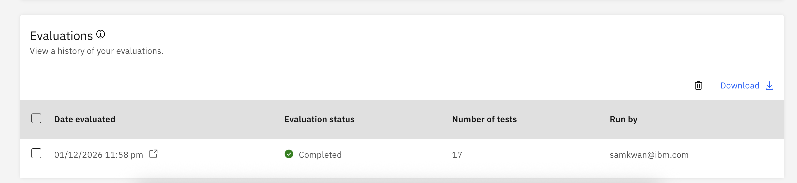

2. Here you can see the evaluation results calculated by watsonx Orchestrate, including the Answer quality metrics, message completion, etc.

   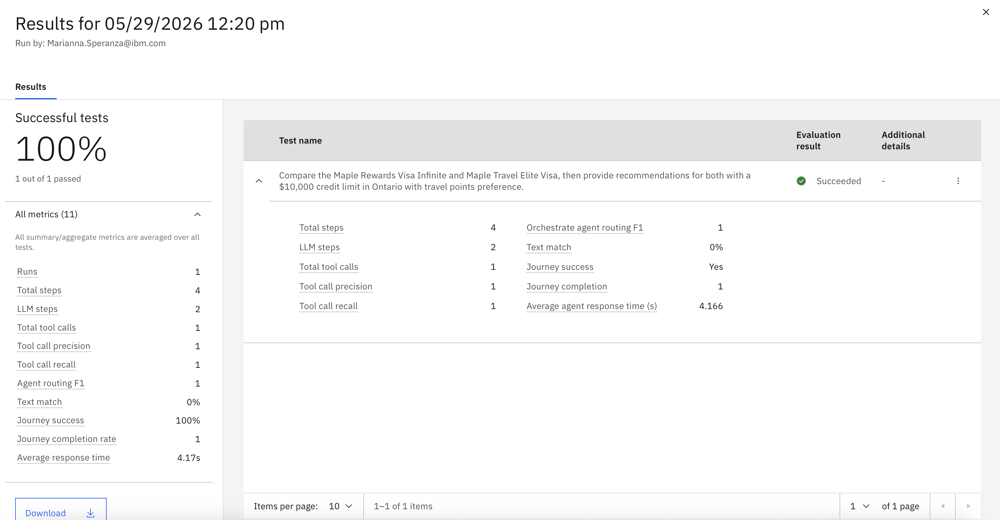

3. You can also click the download button to download the results in CSV format.

To understand the test results, you can review the [watsonx Orchestrate documentation](https://www.ibm.com/docs/en/watsonx/watson-orchestrate/base?topic=agents-testing-evaluating-draft-agent#analyzing-evaluation-metrics).

### Part 5: Production agent monitoring

#### 5.1 Deploy the agent

1. Go back to the agent builder. Click on the **Deploy** button and click **Deploy** to deploy the agent.

   

   

2. Once the agent is deployed, it will ask if you want to Activate agent monitoring. Click **Activate agent monitoring** to proceed.

   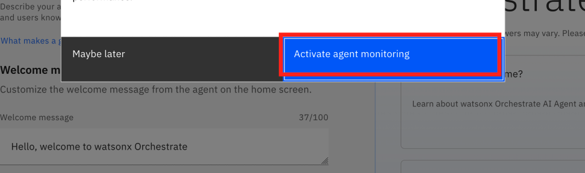

3. Go back to the WXO home page by clicking the watsonx Orchestrate logo on the top left corner.

   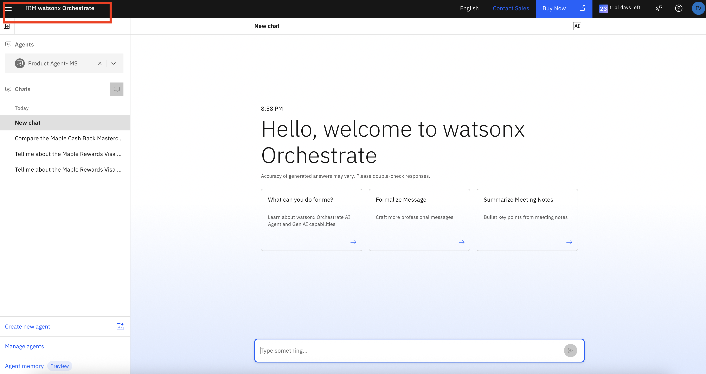

   Click the dropdown list for the agents that was deployed
   
   **Make sure you select the Product agent with your initials (i.g. Product Agent-<your-initials>)**
       

5. Now we can ask a few of the questions from below to the deployed production agent, so we can see how wxo monitors the agent's responses.

   Pick at least 5 questions from below and ask them to the deployed agent.

- **Basic Product Information**

  ```
  Tell me about the Maple Rewards Visa Infinite
  ```
  ```
  What are the travel benefits of the Maple Travel Elite Visa?
  ```
  ```
  What is the cash back rate of the Maple Cash Back Mastercard?
  ```
  ```
  What insurance coverage does the Maple Rewards Visa Infinite have?
  ```
  ```
  What is the annual fee range for Canadian Bank credit cards?
  ```

- ****Card Comparisons****
  ```
  Compare the Maple Rewards Visa Infinite and Maple Travel Elite Visa
  ```
  ```
  Compare the Maple Cash Back Mastercard with the Maple No-Fee Everyday Mastercard
  ```
  ```
  How does the Maple Rewards Visa Infinite compare to competitors?
  ```
- **Quotation/Pricing Queries**
  ```
   I want to apply for a new Maple Rewards Visa Infinite in Ontario with a $10,000 credit limit and travel points preference. What would be   my monthly fee?
  ```
  ```
  Can you give me a recommendation for the Maple Travel Elite Visa in British Columbia? I'm looking at a balance transfer with a     $15,000 credit limit.
  ```
  ```
  What's the monthly cost for a Maple Cash Back Mastercard in Alberta with a $5,000 credit limit and cash back preference?
  ```
**Complex Multi-Step Queries**
  ```
  Tell me about the Maple Rewards Visa Infinite's features, then give me a recommendation for a new card in Ontario with a $10,000 credit limit and travel points preference.
  ```
  ```
  Compare the Maple Rewards Visa Infinite and Maple Travel Elite Visa, then provide recommendations for both with a $10,000 credit limit in Ontario with travel points preference.
  ```

- **General Knowledge Queries**
  ```
  What are the differences between a travel rewards card and a cash back card?
  ```

#### 5.2 WXO Analyze with watsonx.governance

1. Now click the hamburger menu in the top left and select **Analyze**.

   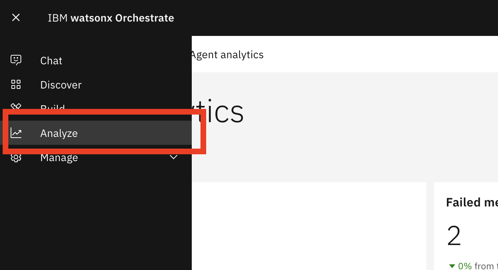
   
2. Here is the overview of all the WXO agent's performance, and all the individual agents are listed here.

These metrics help you to:

- Detect spikes in failed messages that might indicate errors or broken logic.
- Monitor response times to identify performance slowdowns.
- Track message volume to confirm that the agents are active and functioning.
- Track the performance analysis and safety checks of live agents.

   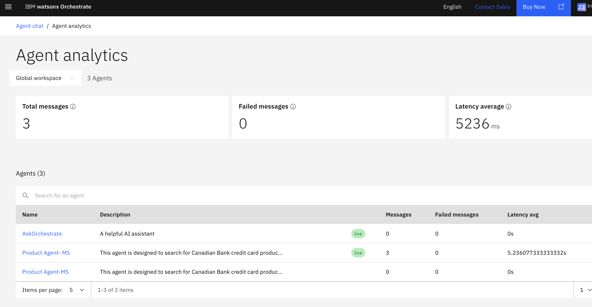

3. Click on the Product agent to see the individual trace of the conversation.
   **Make sure you select the deployed Product agent with your initials (i.g. Product Agent-<your-initials>)**

   It shows the total messages from today, any failed messages, and the Latency average for the agent to answer the query.
   
   These metrics support data-driven decisions about where to optimize or troubleshoot.

Use this data to:

- Compare message volume across agents to understand usage trends.
- Identify agents with high failure rates or long response times.
- Confirm whether agent changes improve or degrade performance.


   There is also a date button on the top right corner so you can switch back to past dates.

   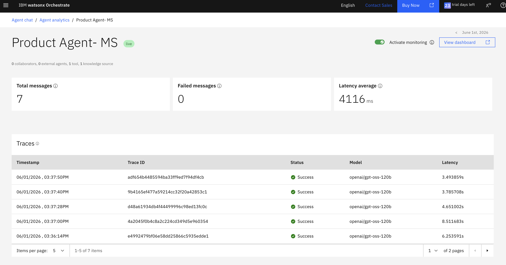

4. Click the first trace from the Traces list.

   Here you can view the entire conversation history to understand what the user and the agent said at each step. This helps you see how an agent processes individual messages.

   Use this table to spot patterns and narrow down issues at the message level. This trace table gives you visibility into each message's lifecycle. It helps you to:

- Identify specific messages that failed and understand why.
- Monitor how different models or prompts affect latency.
- Validate expected behavior for test cases or changes.

   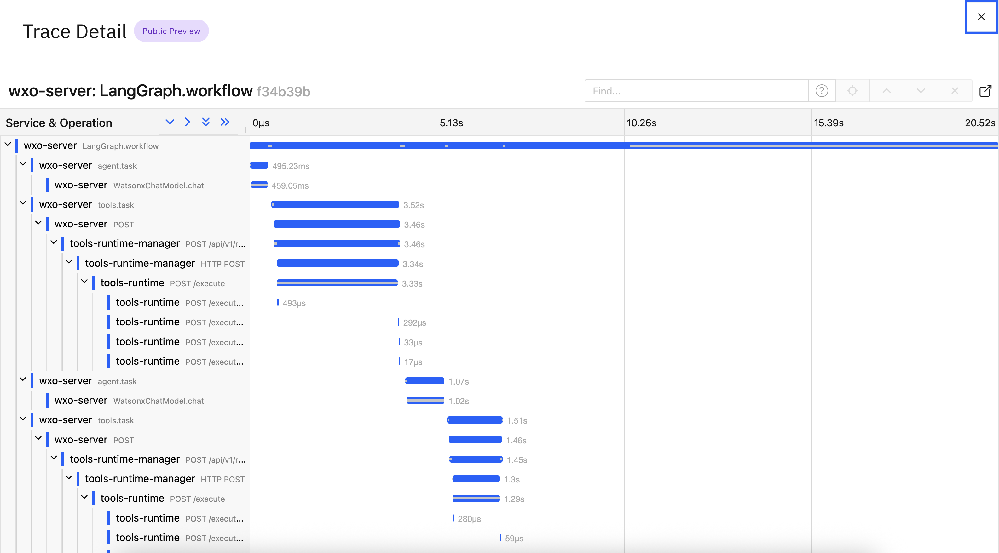

   You can use **Trace Details** to:
   - Debug **tool execution** (inputs, outputs, latency)
   - Validate **knowledge / RAG behavior** (search, model, response)
   - Identify whether issues come from **connectivity, logic, or data**

   If something looks off, traces will show you *where* and *why*.

   In this lab, you can focus on:
   1. Debug tool flow runtime issues
   2. Debug knowledge runtime issues

##### 1. Debugging Tool Flow Runtime Issues

When building agents, the **Trace Details** view helps debug **tool flow execution** end to end.  
If an agent invokes a tool flow, **tool execution traces appear inline**, providing clear visibility into agent behavior and enabling effective troubleshooting.

**Why Use the Trace Details View**

The trace view clearly separates **LLM reasoning** from **tool execution**, allowing you to:

- Understand the full flow from **LLM decision → tool invocation → execution**
- Correlate **tool outcomes** with the agent’s decision-making
- Validate **flow logic and dependencies** in real runtime context
- Identify **latency issues, failures, and performance bottlenecks**

**Actual Tool Execution**

1. **Network Trip Start (`wxo-server`)**

   Expand **wxo-server LangGraph workflow**, scroll down and look for **Tags**, and search for **traceloop.entity.output**.

   - Indicates the start of a network request from **wxo-server**
   - Captures critical runtime details:
     - The input prompt
     - The reasoning of what tool it needs to call
     - Tool input payload
     - Tool output
     - Token usage
   - Useful for correlating **LLM intent** with **tool invocation**

   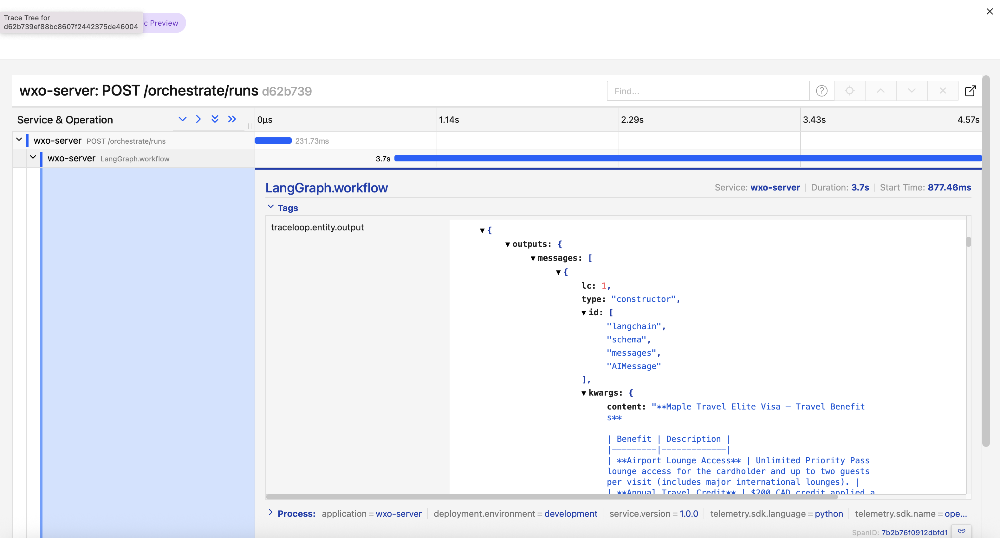

2. **Debugging Knowledge Runtime Issues**

Debug-level trace details provide deep visibility into an agent’s **knowledge (RAG) workflow**.  
They help diagnose issues such as **missing, incorrect, or incomplete responses** by exposing what happens at each stage of message processing.

**What You Can Do with Debug Traces**

Use debug-level trace data to:

- Review **requests and responses** during the **retrieval phase**
- Examine **inputs and outputs** during **answer generation**
- Assess **post-processing status**, latency, and performance metrics

This level of visibility enables **accurate knowledge grounding** and **faster issue resolution**.

**Accessing Debug-Level Trace Details**

For an agent with **knowledge enabled**:

1. Go to **Service & Operations**
2. Navigate to **`wxo-server → tools.task → Tags`**
3. Scroll to **`traceloop.entity.output`**
4. Expand **`artifact → debug`**

   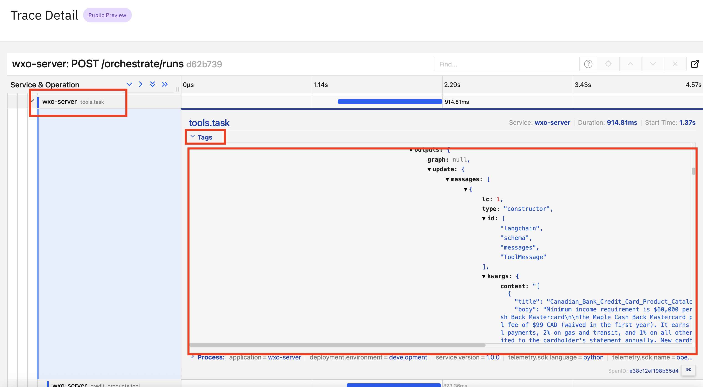
   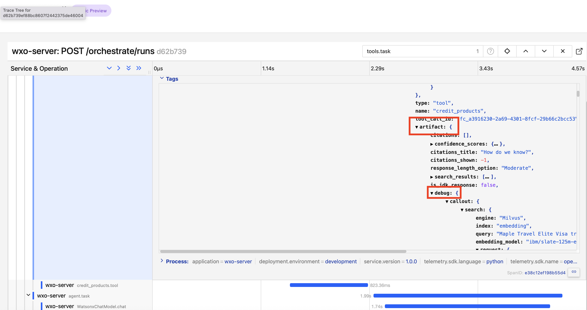

**Agent Analytics – Debug Level**

**Key Runtime Fields**

You can also use Ctrl+F to search for the keywords below.

1. **Callout**

   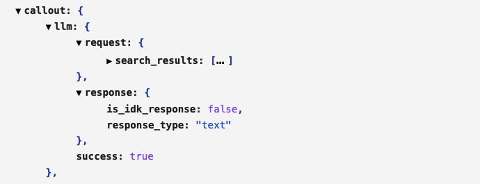

   #### `llm`
   - **input_token_count**  
     Number of tokens in the input message
   - **generated_token_count**  
     Number of tokens generated in the response
   - **model_id**  
     Identifier of the model used

   #### `request`
   - **search_results**  
     Results returned from the knowledge retrieval step

   #### `response`
   - **is_idk_response**  
     Indicates whether the assistant returned an *"I don't know"* response
   - **response_type**  
     Type of response (e.g., `text`, `options`)
   - **text**  
     Final response shown to the user

   #### `success`
   - Indicates whether the response was delivered successfully

2. **Search**

   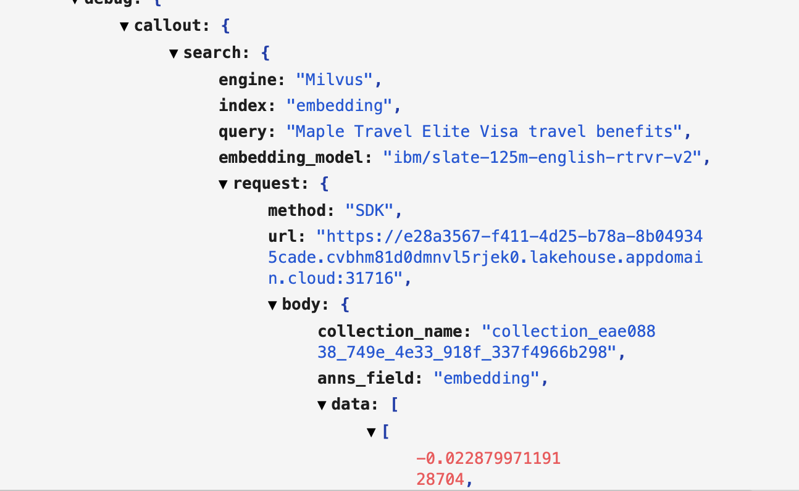

   - **engine**  
     Search engine used at runtime
   - **index**  
     Knowledge index targeted
   - **query**  
     Search query issued by the agent

   #### `request`
   - **body** – Full search request payload (query, filters, etc.)
   - **method** – HTTP method (GET, POST)
   - **path** – Endpoint path
   - **port** – Network port
   - **url** – Full endpoint URL

   #### `response`
   - **body** – Retrieved documents or data returned from the search engine

3. **Metrics**

   - **search_time_ms**  
     Time spent performing knowledge retrieval
   - **answer_generation_time_ms**  
     Time spent generating the response
   - **total_time_ms**  
     End-to-end latency of the RAG pipeline

   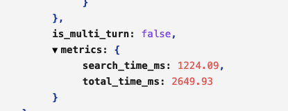

4. **Other**

   - **is_multi_turn**  
     Indicates whether previous conversation context was used to generate the current response

**Why This Matters**

Debug-level knowledge traces help you:

- Identify **failed, empty, or low-quality searches**
- Detect **latency bottlenecks** in retrieval or generation
- Validate **model inputs and grounding sources**
- Confirm correct **knowledge usage and response behavior**

If the agent confidently answered the wrong thing—or politely said "I don't know" when it shouldn't—this is where the truth lives.

---

#### 5.3 View watsonx.governance Dashboard

1. Now click the **View dashboard** button at the top right corner.
   **Make sure you select the deployed Product agent with your initials (i.g. Product Agent-<your-initials>)**

   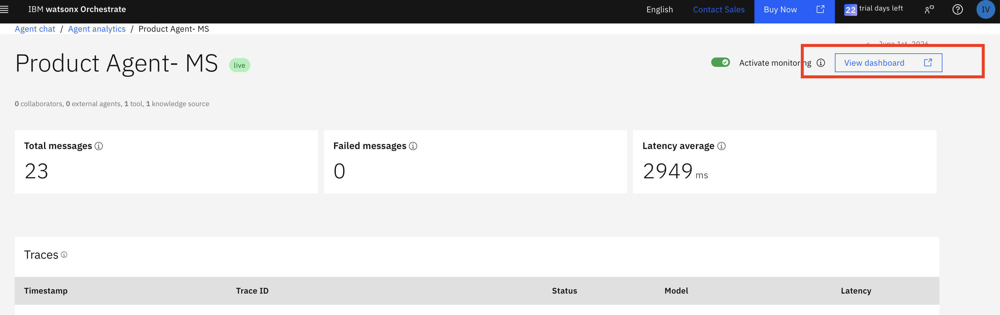

2. You will be navigated to the **watsonx.governance** dashboard.

   Review the **Evaluation** tab to see more information about the conversations, messages, and tools that are used by the agent. Alerts show you metrics that are outside their threshold values.

   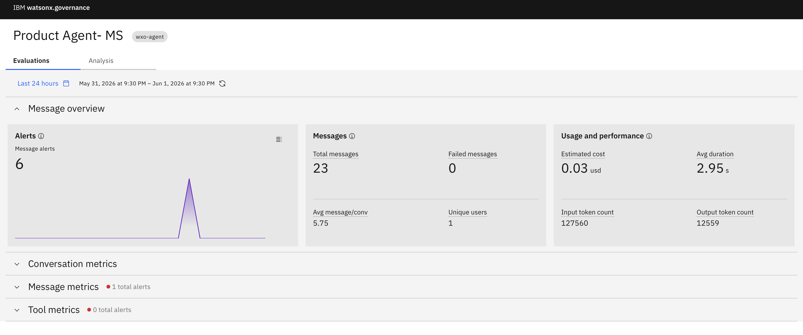

3. Move your mouse over the Alerts dashboard and click on the latest timestamp at which you tested the agent.

   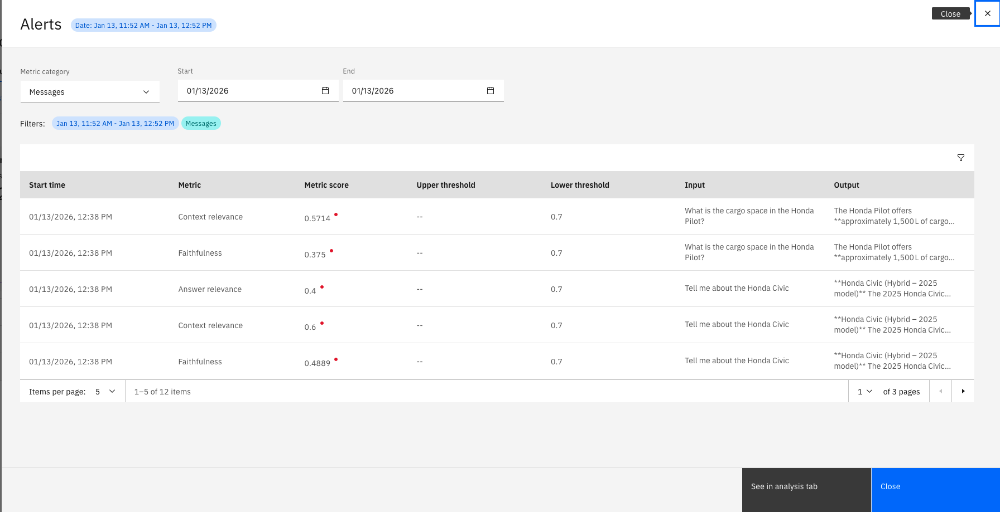

4. You can review the metrics like cost, input token, output token in 3 levels:
   - Conversation level
   - Message level
   - Tool level

   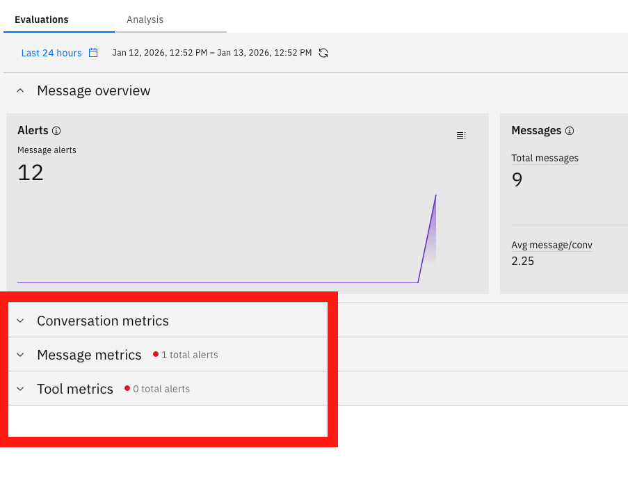

5. To understand the metrics and how they are calculated, go to this documentation for details: [watsonx Orchestrate Agent Monitoring Metrics](https://dataplatform.cloud.ibm.com/docs/content/wsj/model/wos-eval-agents.html?context=wx#metrics-for-agent-monitoring)

6. When you want to see greater detail, click the **Analysis** tab.

   You can analyze the distribution of conversation metrics, view the conversations for a time period, and then view the metric values at a specific time point. You can also explore the individual messages within a conversation.

   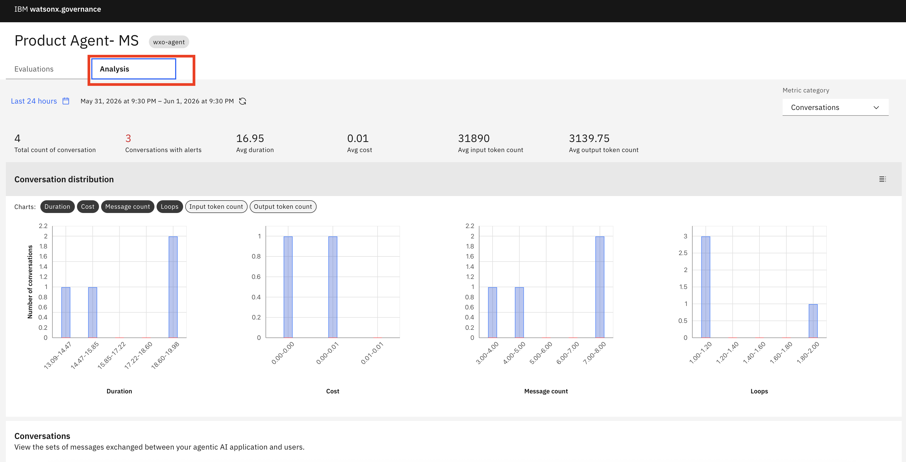

7. In the **Conversation** table, click on the 3 dots and click **View details**.

   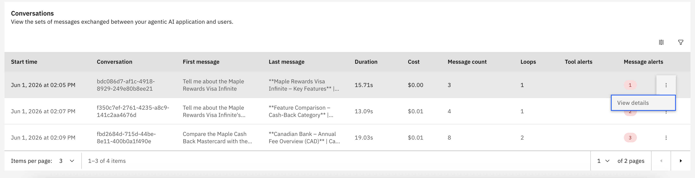

8. Here you can review the whole conversation (chat session) and see the metrics for each message.

   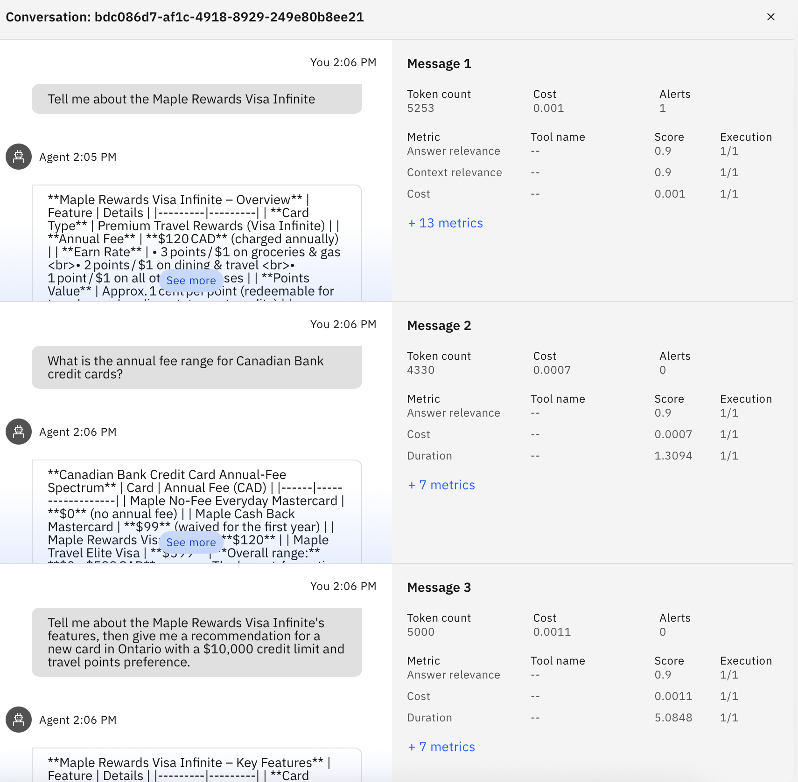

---

## Conclusion

**Congratulations!**  
This lab guided you through the complete process of building and deploying a Honda Product Agent using watsonx Orchestrate, with a focus on agent governance and monitoring. You learned how to combine Retrieval-Augmented Generation (RAG) for knowledge retrieval and a custom quotation tool, but the primary takeaway is how to evaluate, monitor, and govern AI agent performance in production—ensuring your agent operates reliably, transparently, and in alignment with business goals.
