# 🧑‍💼 Managing AI Risk and Compliance with watsonx.governance

## You need a seperate Lab environment from IBM. Please contact IBM team if you want to try it.

## 👋 Meet Jose – The Chief Risk Officer

Jose works at **TechCorp Inc.**, a large multinational enterprise using AI to improve HR processes like hiring and employee planning.

But there was a problem...  
AI was everywhere, but **nobody really knew**:
- Who built what
- Whether the models were fair
- If they followed rules like GDPR etc.
- What to do when something went wrong

Jose was responsible for managing all that risk — but he had **no clear way** to do it.

So, Jose and his team created decided to leverage **watsonx.governance** to make AI governance easy, clear, and reliable.

## 🎯 What Jose Wanted to Fix

Jose didn’t want to manage critical governance processes through spreadsheets, emails or slack messages. 

He wanted a simple system that would:

- ✅ **Track every AI model from start to finish**
- ✅ **Make sure models follow the rules (like GDPR, EU AI Act, etc.)**
- ✅ **Foster collaboration with the development team — without slowing them down**
- ✅ **Catch problems early and fix them fast**
- ✅ **Keep everything ready for audits**

And that’s where **watsonx.governance** helps.

## 👥 Who's involved in AI Governance?

AI Governance is a teams sport involving different roles in an organization. Though it's not uncommon to find scenarios where folks could perform the roles or severals personas, here's what these roles might look like:

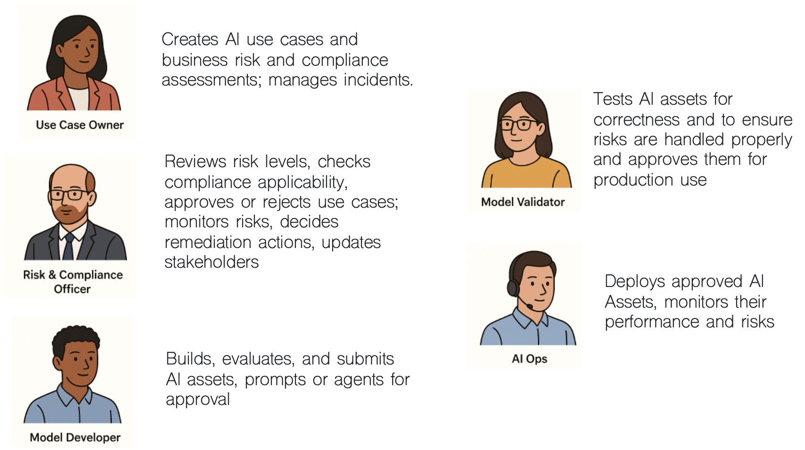

<!--
| 👤 **Role**               | 💡 **What They Can Do**                                                                 |
|--------------------------|------------------------------------------------------------------------------------------|
| **Use Case Owner**       | Create model use case, complete risk and compliance assessments, manage incident updates |
| **Stakeholders**         | Review risk levels, check compliance applicability, approve or reject use cases          |
| **Model Developer**      | Build, evaluate, and submit AI models for approval                                       |
| **Model Validator**      | Review model ethics and fairness, approve for production                                 |
| **Operations (IT/MLOps)**| Deploy approved models, monitor model performance and risks                              |
| **Risk & Compliance Officer** | Monitor risks, decide remediation actions, update stakeholders                     |

-->

## 🚀 7-Step AI Governance Implementation (Used by Jose’s Team)

A simple, structured process for managing AI models from idea to remediation.

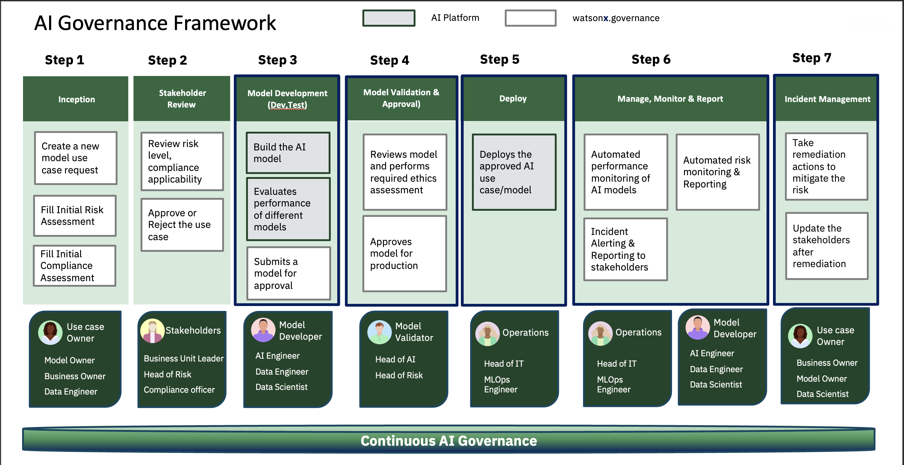
<!--

### 🔹 Step 1: Create a New Model Use Case  
**Who:** Use Case Owner (Model Owner, Business Owner, Data Engineer)  
- Submit a new model use case request  
- Complete initial risk and compliance assessments  

📦 *Module: Use Case Management*

---

### 🔹 Step 2: Review Risk & Compliance  
**Who:** Stakeholders (Business Unit Leader, Head of Risk, Compliance Officer)  
- Evaluate risk level and compliance applicability  
- Approve or reject the use case  

📦 *Module: Stakeholder Review*

---

### 🔹 Step 3: Develop the Model  
**Who:** Model Developer (AI Engineer, Data Engineer, Data Scientist)  
- Build and test multiple AI models  
- Submit the best model for validation  

📦 *Module: Model Development*

---

### 🔹 Step 4: Validate the Model  
**Who:** Model Validator (Head of AI, Head of Risk)  
- Perform ethics and fairness assessments  
- Approve model for production use  

📦 *Module: Model Validation & Approval*

---

### 🔹 Step 5: Deploy the Model  
**Who:** Operations Team (Head of IT, MLOps Engineer)  
- Deploy the approved AI model to production  
- Ensure deployment is traceable to governance  

📦 *Module: Deployment Tracker*

---

### 🔹 Step 6: Monitor the Model  
**Who:** Operations & Risk Team  
- Monitor model performance and risk continuously  
- Trigger alerts and reports for anomalies  

📦 *Module: Monitor & Report*

---

### 🔹 Step 7: Manage Incidents  
**Who:** Use Case Owner & Compliance Team  
- Take remediation actions for issues and risks  
- Update stakeholders after resolution  

📦 *Module: Incident Management*

->>
---
<!--
## 🗂️ Summary Table

| ✅ **Step** | 📦 **Module**             | 👤 **Who’s Involved**         | 🧭 **What Happens**                                 |
|-------------|---------------------------|-------------------------------|-----------------------------------------------------|
| 1           | Use Case Management       | Use Case Owner                | Submit a new model use case and fill assessments    |
| 2           | Stakeholder Review        | Risk & Compliance Stakeholders| Review risk level, approve or reject the use case   |
| 3           | Model Development         | AI Engineers / Data Scientists| Build and test the AI model                         |
| 4           | Ethics Validation         | Model Validator (e.g. Head of AI) | Validate fairness, explainability, and readiness |
| 5           | Deployment Tracker        | MLOps / IT Team               | Deploy the model into production                    |
| 6           | Monitor & Report          | Operations / Risk Team        | Monitor model performance and risk metrics          |
| 7           | Incident Management       | Compliance Team & Use Case Owner | Log and remediate model-related issues         |

## 💬 What Jose Says Now

> _“Before AskHR, we had no clear process. Now everyone knows what to do, models are better, and we’re always ready for audits.”_

-->

## 📄 Hands-on step-by-step lab

## This lab will walk you through the following steps in AI Governance Framework
  - [👩‍💼 1. Use Case Owner Responsibilities](#-1-use-case-owner-responsibilities)
  - [👩‍💼 2. Business Unit Leader Responsibilities](#-2-business-unit-leader-responsibilities)
  - [👩‍💼 3. Model Developer Responsibilities](#-3-model-developer-responsibilities)
  - [👩‍💼 4. Model Validator Responsibilities](#-4-model-validator-responsibilities)
  - [👩‍💼 5. AIOps Engineer Responsibilities](#-5-aiops-engineer-responsibilities)
  - [👩‍💼 6. Operations Team \& Model Developer Responsibilities](#-6--operations-team--model-developer-responsibilities)

## ⚙️ Pre-requisites

* Services:  watsonx, OpenPages.
<!--* Instructor access to orchestration scripts-->

## 🚀 Getting Started

1. Login to [IBM Cloud](https://cloud.ibm.com)
2. Navigate to **Resource List > AI / Machine Learning**
3. Launch the **OpenPages** instance from the list.   
*If you receive an authorization error, add **/app/jspview/react/grc/dashboard/Home** to the end of the URL.*

<!--
> 
-->

> [!Important]
> After logging make sure to check in Profile that it has to be set as **Watsonx governance MRG Master**:

## 👩‍💼 1. Use Case Owner Responsibilities

<!--As a UseCase Owner, your responsibilities include:

* Creating the business and child entity
* Defining the use case (AskHR - Agentic AI)
* Submitting associated risks for approval
* Reviews submitted risks 
  
🧭 Steps:

| Step               | Action                        | Status Update                 |
| ------------------ | ----------------------------- | ----------------------------- |
| Risk Received      | Review risk description       | `Awaiting Assessment`         |
| Perform Assessment | (Optional) Add documentation  | `Awaiting Approval`           |
| Finalize Decision  | Approve / Mark Not Applicable | `Approved` / `Not Applicable` |
-->

### Creating Business Entities
> Note : Typically the steps in this section will be performed by the person who owns the AI use case who would be assigned the role `Use case owner` in IBM Openpages. However, only for the purpose of this lab you will continue to use `Watsonx governance MRG Master` role.

You will creating a **Primary Business Entity** and a **Child Business Entity** in watsonx.governance for the **AskHR Project**, under the **Techcorp** organization.

In **IBM OpenPages**, a **Business Entity**:

* Represents a logical division or unit within an organization.
* Serves as a container for managing risks, controls, issues, and processes.
* Supports parent/child hierarchy to enable structured governance.

#### 🎯 Structure to Be Created

| Entity Level   | Entity Name   | Description                                                        |
| -------------- | ------------- | ------------------------------------------------------------------ |
| Primary Entity | Techcorp      | Main entity representing the organization.                         |
| Child Entity   | AskHR - GenAI | GenAI use case entity under the AskHR project, linked to Techcorp. |

#### 1️⃣ Step 1: Create Primary Business Entity — Techcorp

1. **Log in as:**
   `Use case owner`

2. **Navigate to the Business Entity Section:**

   * Click the **Hamburger Menu (☰)**.
   * Go to **Organization**.
   * Select **Business Entity**.

   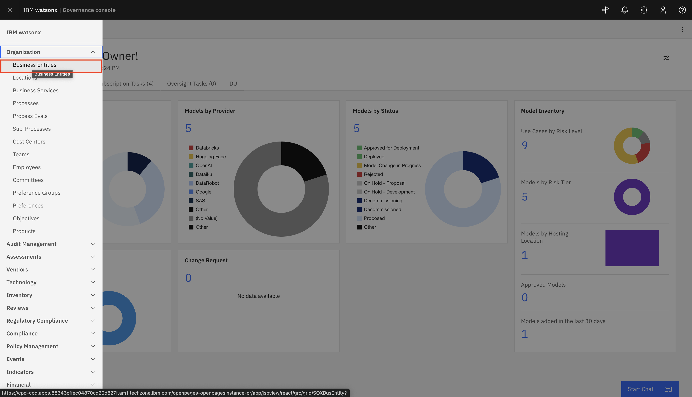

3. **Create a New Entity:**

   * Click **Create New**.
   * Fill in the following fields:

   | Field             | Value                                |
   | ----------------- | ------------------------------------ |
   | **Entity Name**   | `Techcorp`                           |
   | **Description**   | Parent entity representing Techcorp. |
   | **Owner**         | Search for your name and select it   |
   | **Business Unit** | As applicable                        |

4. **Click Save.**

   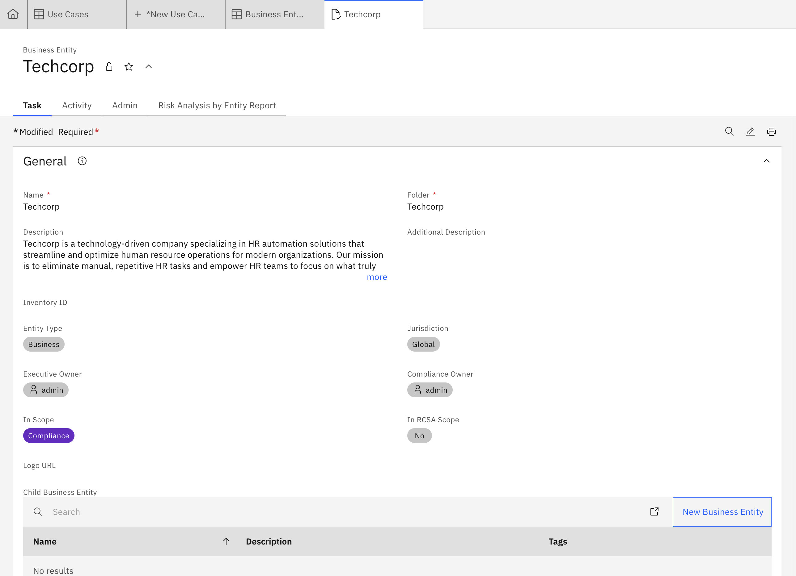

#### 2️⃣ Step 2: Create Child Business Entity — AskHR - GenAI

1. After **Techcorp** is created, go back to Business Entities `(Hamburger Menu (☰) > Organization > Buesiness Entities)` and click **Create New** again to add the child entity.

2. Fill in the following fields:

   | Field                       | Value                                                    |
   | --------------------------- | -------------------------------------------------------- |
   | **Entity Name**             | `AskHR - GenAI`                                          |
   | **Description**             | Child entity for the GenAI use case under AskHR project. |
   | **Owner**                   | Search for your name and select it                       |
   | **Business Unit**           | As applicable                                            |
   | **Primary Business Entity** | Select `Techcorp` from the dropdown or lookup list.      |

   

3. ✅ **Ensure `Techcorp` is selected** as the **Primary Business Entity**.

4. **Click Save.**

---

#### ✅ Example Child Entity Summary

* **Entity Name:** `AskHR - GenAI`
* **Description:** Child entity for the GenAI use case in the AskHR project.
* **Primary Business Entity:** `Techcorp`
* **Owner:** Use case owner

---

#### 📊 Summary

By setting up:

* **Techcorp** as the **Primary Business Entity**, and
* **AskHR - GenAI** as a **Child Entity** linked to it,

You enable:

* Clear governance hierarchy
* Focused compliance tracking
* Organized risk and issue management within your AI initiatives

---

👏 **Well Done!**
Creating structured Business Entities in OpenPages sets a strong foundation for scalable, transparent, and well-governed AI initiatives.

### Creating and defining an AI use case

#### 📌 What is a  Use Case?

A **Use Case** in IBM Governance Console is used to document and govern one or more models developed to fulfill a specific business objective. It acts as a centralized record for model development, compliance, risk tracking, and approval workflows.

> ✅ **A Use Case should be created whenever there's a business requirement that needs one or more AI/ML assets (e.g., models, prompts, or agents).**

#### 🎯 Why Create a Use Case?

Creating a Use Case helps:

* Centralize governance of related models.
* Manage risks, compliance requirements, and ownership in one place.
* Track model performance and approvals across the model lifecycle.
* Link models to Business Entities for traceability and audit readiness.

#### 🛠️ Step-by-Step Guide to Create a Use Case

#### 1️⃣ Navigate to the Use Case Section

* Click on the **Hamburger Menu (☰)**.
* Go to **Inventory**.
* Select **Use Case**.

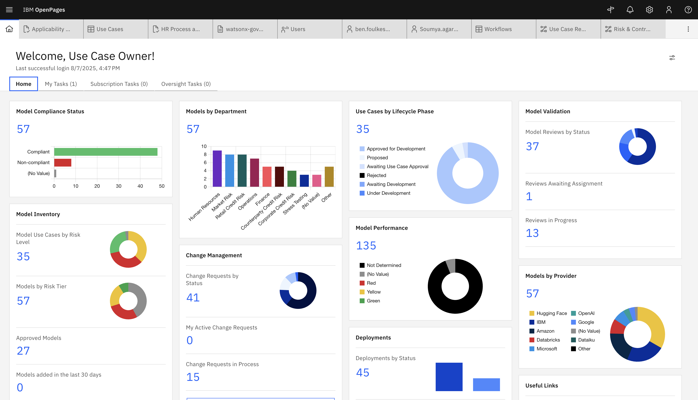

#### 2️⃣ Click **“Create New”**

* Click the **Create New** button at the top of the Use Case list view.

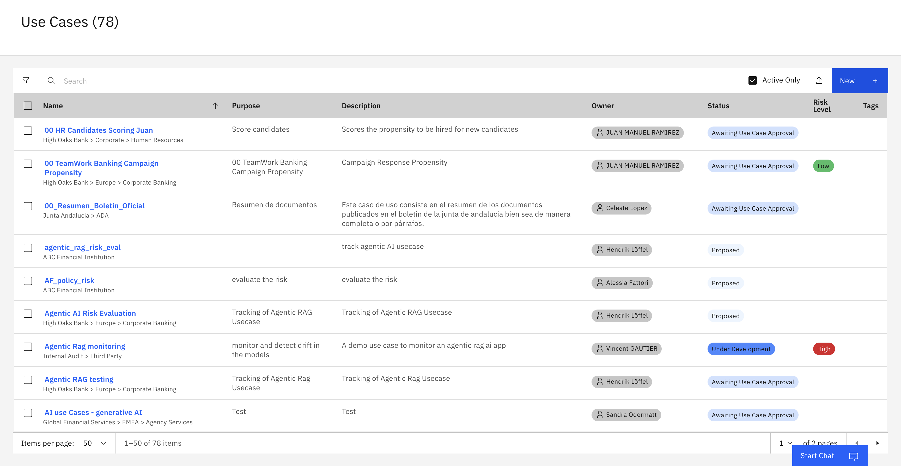

#### 3️⃣ Fill in the Required Fields

Fill in the form using the following example:

| Field                       | Example Entry                                   |
| --------------------------- | ----------------------------------------------- |
| **Name**                    | AskHR Automation using Agentic AI               |
| **Owner**                   | Search for your name and select it              |
| **Purpose**                 | Automate HR processes using Generative AI.      |
| **Description**             | This use case tracks GenAI-based HR automation. |
| **Primary Business Entity** | Techcorp                                        |

> ⚠️ All required fields must be completed before you can save.

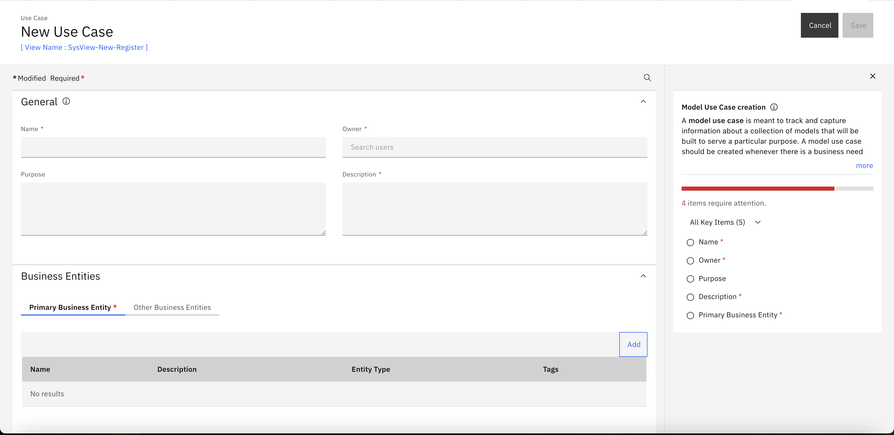

#### 4️⃣ Save the Use Case

* Click **Save** to create and register the Use Case record.

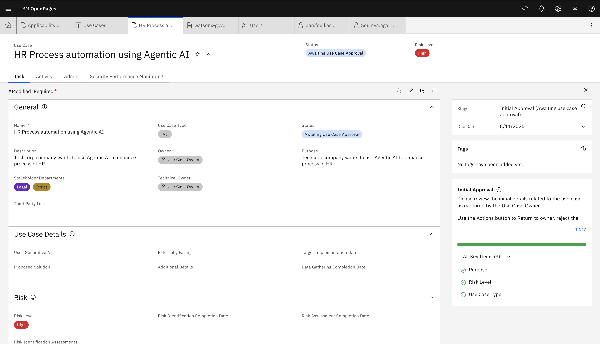

#### 5️⃣ Set the Risk Level

After saving:

* Open the newly created Use Case.
* Scroll down to the **Risk** section.
* Select an appropriate **Risk Level** (Low, Medium, or High).
* Click **Save** again.

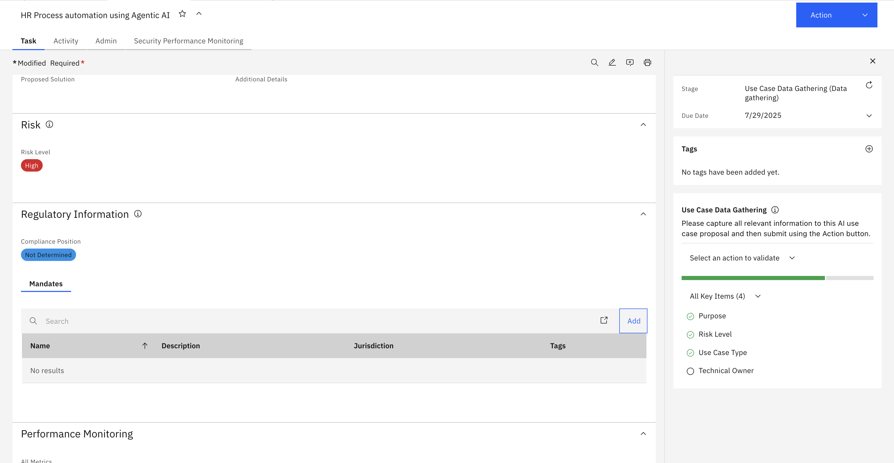

#### ✅ Example Use Case Summary

| Field               | Value                                    |
| ------------------- | ---------------------------------------- |
| **Name**            | AskHR Automation using Agentic AI        |
| **Owner**           | Search for your name and select it       |
| **Purpose**         | Automate HR tasks using Generative AI    |
| **Description**     | Tracks GenAI model for internal HR tasks |
| **Business Entity** | Techcorp                                 |
| **Risk Level**      | Medium (adjust as needed)                |

After setting the risk level Go on action tab and click on **Submit for initial approval**

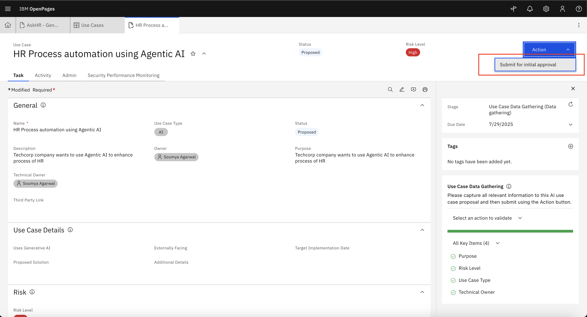

#### 6️⃣ Navigate to the Questionnaire Assesment section

* Click on the **Hamburger Menu (☰)**.
* Go to **Assesment**.
* Select **Questionnaire Assessment**.

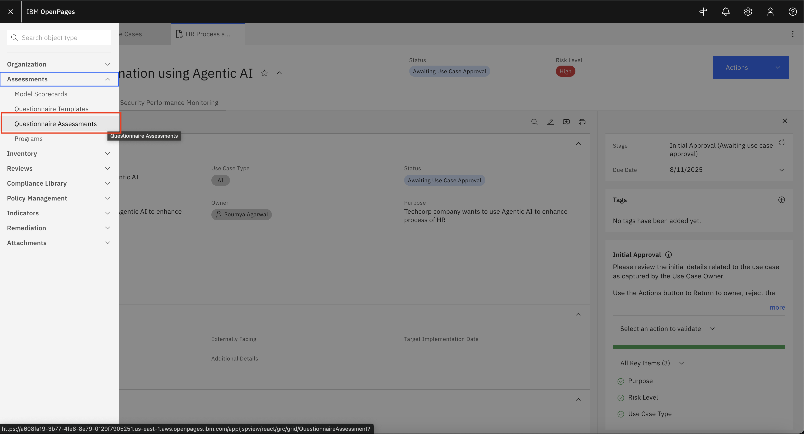  

#### 7️⃣ Complete Risk Assessment

In the Questionnaire Assessment page

* Click on the Risk Assessment associated with the Use Case.

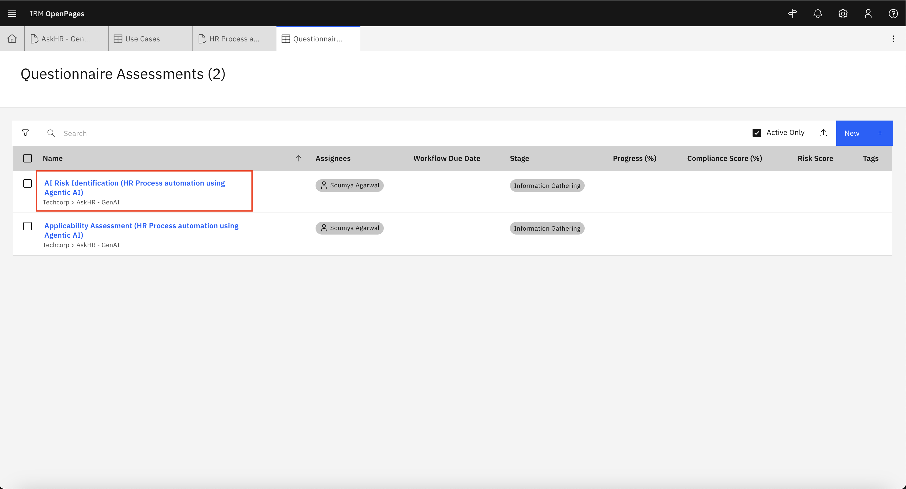  

* This opens up the Risk Assessment Questionnaire which has two sections - AI Use case risk identification section & Agentic AI Use Case Risk Identification as visible in the left pane.

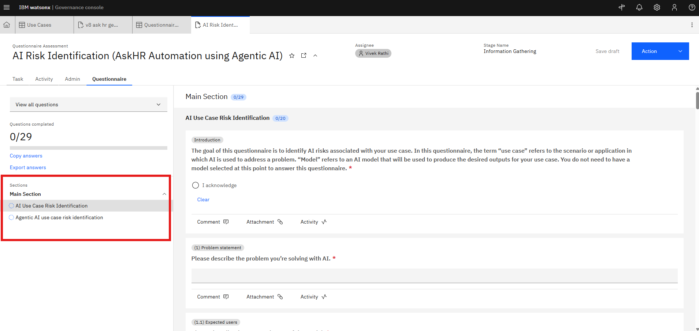  

* The use case owner is required to fill out all the required questions in both the sections.
* For the purpose of this lab, Only select the answer exactly as shown in the “Answer” column in both sections. These answers are required for completing this guide accurately. 
* Use dropdowns, radio buttons, and text fields as applicable.

##### AI Use case risk identification section
  

| Question                                                     | Answer         |
|--------------------------------------------------------------|----------------|
| Please describe the problem you’re solving with AI.          | Building assistant to answer HR related questions. |
| Please describe the expected users of the model.             | Fulltime employees in the org in engineering, sales and HR domain |
| Are you planning to use generative AI model(s)?              | Yes            |
| Are you planning to use agentic AI?                          | Yes            |
| Will the model input include content provided by people?     | Yes            |
| Will the model input include personal information?           | Yes            |
 
##### Agentic AI Use Case Risk Identification

| Question                                                                 | Answer         |
|--------------------------------------------------------------------------|----------------|
| Does the agent make decisions that affect people?                        | Yes            |
| Does the use case require a person to work together with the agent?      | Yes            |
| Does the person make the final say on the agent’s decisions/actions?     | Yes            |
| Is the agent being used for a different purpose than intended?           | No             |
| Is the agent expected to align with human values, ethics, or policies?   | Yes            |
| Do the agent’s tasks require planning or revisiting actions?             | Yes            |
| Does the agent use other agents, tools, or resources?                    | Yes            |
| Can these tools/agents contain sensitive information?                    | No             |
| Do the agent’s actions create, update, or delete content?                | No             |
| Are the agent’s outputs used by other tools or agents?                   | No             |
| Is the agent’s output observable by the user?                            | Yes            |
| Will an end user supply inputs to the agent?                             | Yes            |
| Will end users include people who may attack or misuse the agent?        | No             |
| Are any tools/agents used by the agent external to the organization?     | No             |

* Click `Actions` > `Submit and close` once all questions are answered.

#### 8️⃣ Complete Compliance Assessment

In the Questionnaire Assessment page

* Click on the Applicability Assessment associated with the Use Case.

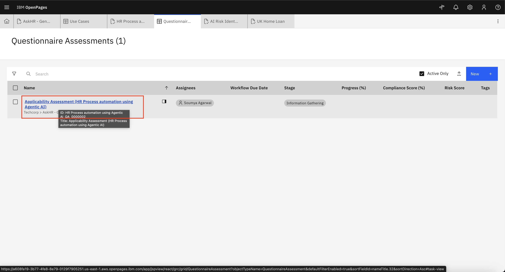  

* Fill out the questions as below:

| Question                                                                       | Correct Answer                                                        |
|--------------------------------------------------------------------------------|------------------------------------------------------------------------|
| How would you classify your organization?                                      | None of the Above                                                     |
| The AI System may be out of scope – contact your Compliance Department for assistance. | I confirm that I will contact the Compliance Department for guidance. |

> Note: In real world scenario the use case owner will fill up the questionnaire as applicable to their business landscape and organization policy.

✅ Once both assessments are submitted, the risks will be assigned for the use case. 

- After the assesments go back to your use case using `Hamburger Menu (☰) > Inventory > Use cases > Search for your use case name > Click on your use case in the search result`
  
- Review the Risks associated in **Risk** List Section:

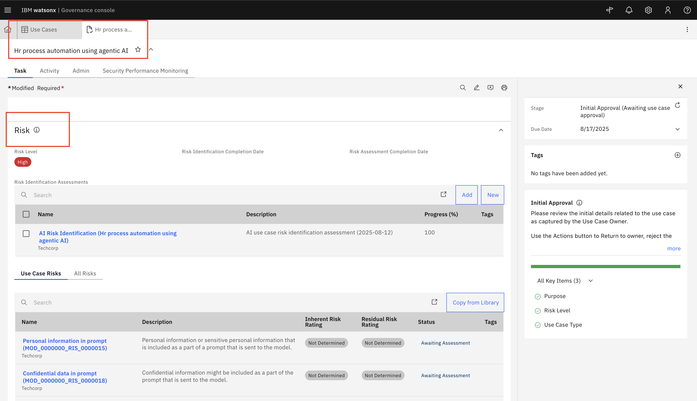 

- In the use case In **regulatory information** section Go to **mandates** tab and click on **Add**

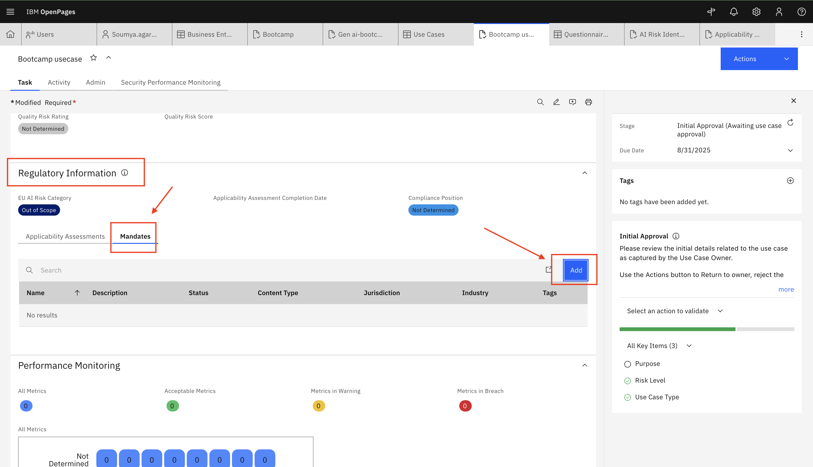 

- Select appropriate **Mandates or Risk & Compliance Act** and associate to the use case.

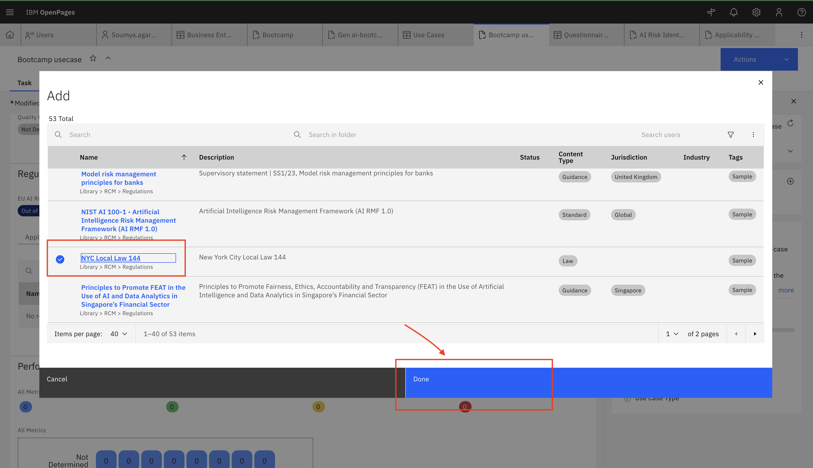 

-Now you can see in **mandates** section **Mandates or Risk & Compliance Act** are added.

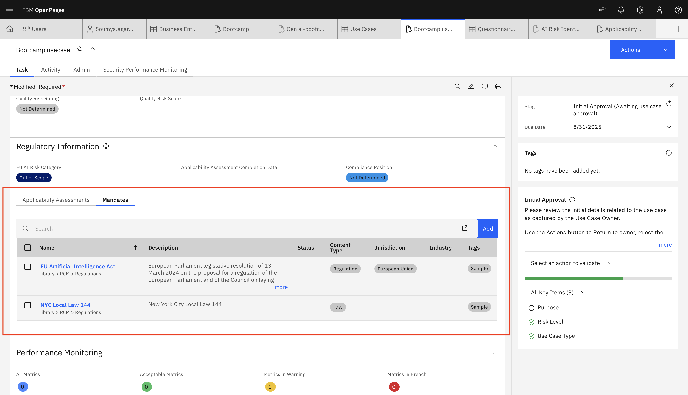 

### 🛡️ Risk Review Process for Use case owner

 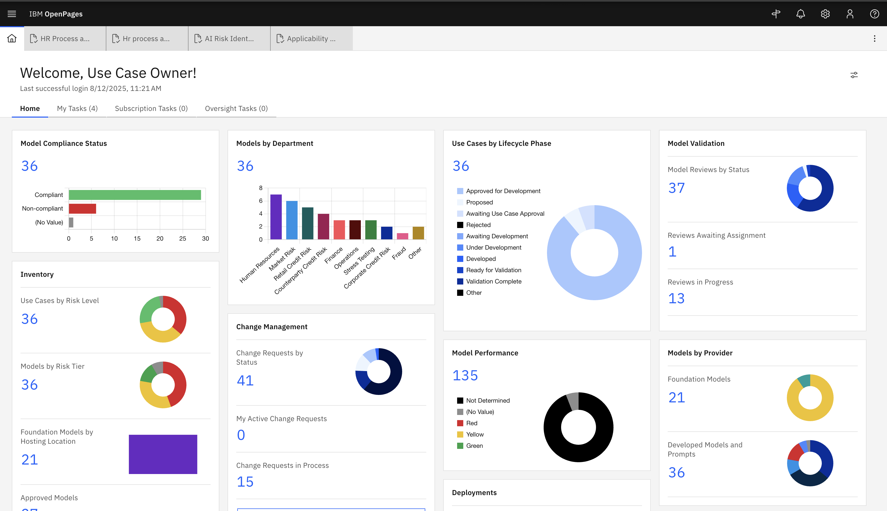
 
As a **Use Case Owner**, your responsibility is to review risks submitted as part of a  Use Case and determine the appropriate risk status. This process ensures that all risks are evaluated, documented, and aligned with your organization's governance standards.

#### 🧩 Workflow Context

This step occurs **after** a Use Case Owner:

* Creates a  Use Case, and
* Submits a Risk Identification Assessment.

You will now:

* Review the submitted risk,
* Perform assessments if necessary,
* Update the status, and
* Forward the task for stakeholder approval.

#### 🛠️ Step-by-Step Task Instructions

#### 1️⃣ Risks are populated and now **Use Case Owner** can review each risk:

  

#### 2️⃣ Review Risk Details

* Open the risk record.
 
* Review (or Fill - optional) the field values including:

  * Risk Title
  * Description
  * Risk Category
  * Potential Impact
  * Mitigation Plans (if any)
  * Inherent Risk Rating
  * Residual Risk Rating
  
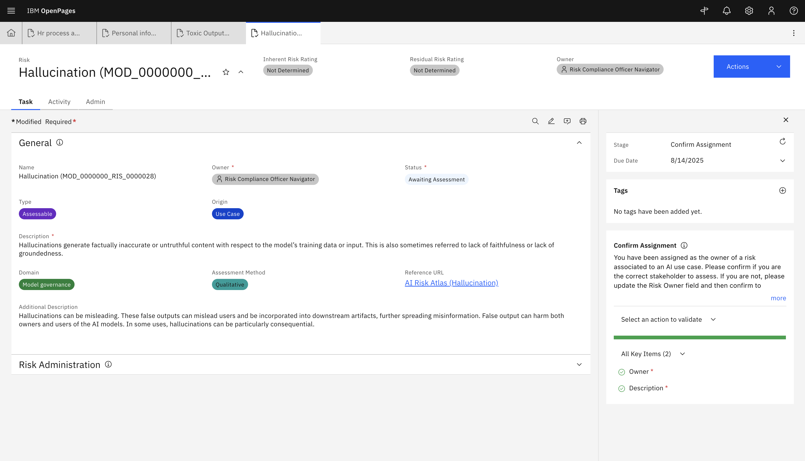

#### 3️⃣ Decide if a Risk Assessment is Required

* In real-world scenario for each risk that is listed on the use case you would decide whether you want to assess it or not. Depending on your choice this would further invoke control assessment workflows for each risk. For the purposes of this lab only, feel free to not assess any risk and set the status to approved for all the risks. 

| If...                   | Then...                                         |
| ----------------------- | ----------------------------------------------- |
| Assessment is required  | Proceed to fill in the Risk Assessment section. |
| No assessment is needed | Move directly to setting the risk status.       |

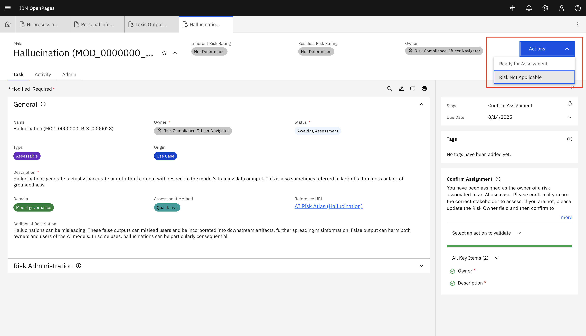

#### 4️⃣ Update the Risk Status

Only for the purpose of this lab you will set the **Status** to **Approved** for each risk, In real world scenario the status could be set to one of the below values:

| **Scenario**                   | **Set Status To**     |
| ------------------------------ | --------------------- |
| Still under review             | `Awaiting Assessment` |
| Assessment completed           | `Awaiting Approval`   |
| Risk is accepted and validated | `Approved`            |
| Risk is not relevant           | `Not Applicable`      |

* To update the status of each risk, open the risk listed on your use case by clicking on it, then `switch to the 'Admin' tab on the Risk page > Scroll down to "Status and Approval" section` set **Status** to `Approved`. 
* Repeat this process for each risk identified on your use case.

*TIP: If you accidently closed your use case tab, you can access it by `Hamburger Menu (☰) > Inventory > Use cases > Search for your use case name > Click on your use case in the search result`*

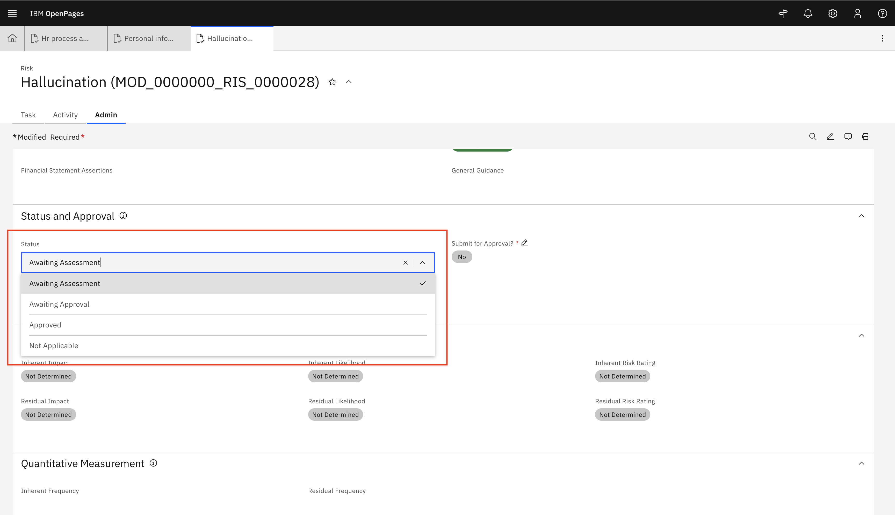

#### 5️⃣ Save and Complete the Task

* Click **Save** after entering the assessment or updating the status.

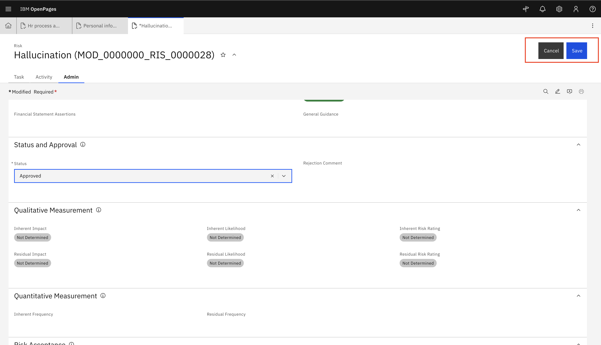

* After completing all risk review . Go to actions and click **Submit for Stakeholder Review** to progress the workflow to the Stakeholder stage.

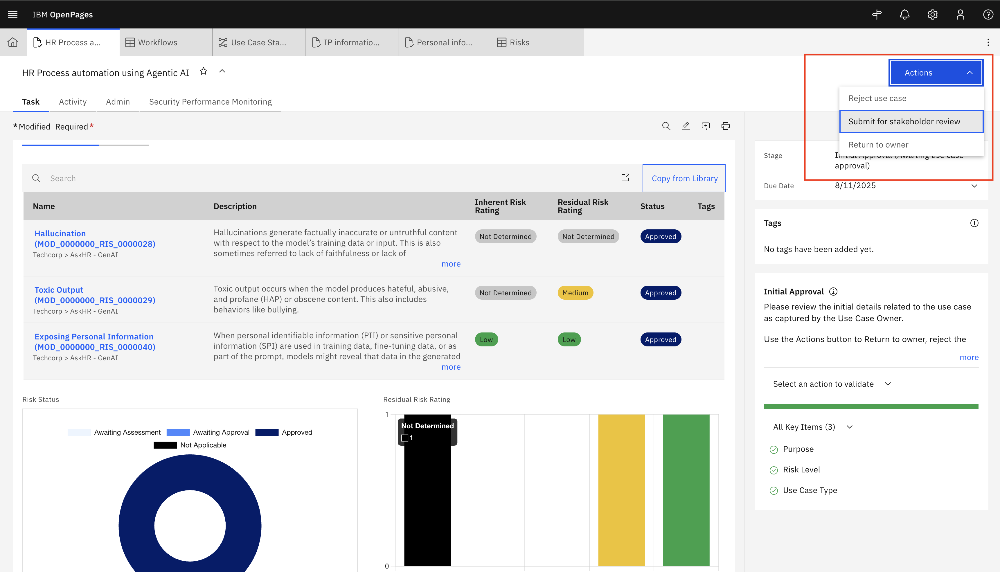

### 📋 Summary Table

| **Step**           | **Action by Use case owner**                  | **Status to Set**             |
| ------------------ | ---------------------------------- | ----------------------------- |
| Risk Received      | Open and review the assigned risk  | `Awaiting Assessment`         |
| Perform Assessment | Complete assessment if needed      | `Awaiting Approval`           |
| Approve or Close   | Mark as approved or not applicable | `Approved` / `Not Applicable` |
| Submit Task        | Save and complete the task         | —                             |

### ✅ Example

A typical Risk Compliance review might follow this path:

1. Risk received → Review details.
2. Determine assessment is needed → Fill in assessment form.
3. Set status to **Awaiting Approval**.
4. Save and complete the task.

By completing the **Risk Compliance review**, you help ensure:

* Risks are properly assessed and documented,
* Compliance is upheld,
* The organization follows a consistent and accountable risk management process.

### 🎉 Well Done!

You have successfully created a **Model Use Case** and filled assesments in Watsonx.governance.

This enables:

* Structured governance
* Risk and compliance tracking
* Streamlined collaboration across stakeholders

Use Cases provide visibility, traceability, and control across the lifecycle of AI models.

Once the guides above have been completed, the Use Case Owner would wait for steps 2-6 in the AI Governance Implementation to be completed.

## 👩‍💼 2. Business Unit Leader / Stakeholder Responsibilities

As a Business Stakeholder, your input ensures the use case aligns with business strategy and acceptable risk levels, you will perform the **final risk endorsement** before the risk becomes officially active for controls and monitoring.

> Note : Typically the steps in this section will be performed by Business Stakeholder / Risk Compliance officer who would be assigned the appropriate role in IBM Openpages. However, only for the purpose of this lab you will continue to use `Watsonx governance MRG Master` role.

---

#### 📝 Task Summary

You have received the task in **My Tasks** with **Use case** name:
**🗂️ “Use case Name- HR process automation using Agentic AI”**

As the Business Unit Leader, your role is to **approve or reject** a fully reviewed risk that has already passed through assessment in previous steps.

---

#### ✅ Your Responsibilities

* Review all risk details submitted by the Use Case Owner
* Make the **final decision** for risk activation in OpenPages

---

#### 🛠️ Steps to Complete

#### 1️⃣ Open the Assigned Task

* Navigate to **My Tasks**
  
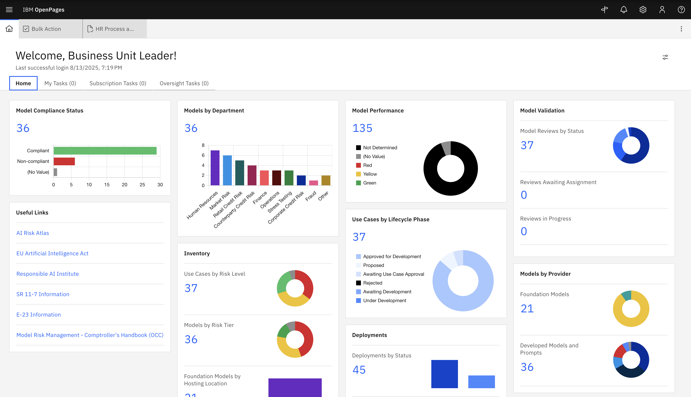

* Locate: **“HR process automation using Agentic AI”** which is **Usecase** name:

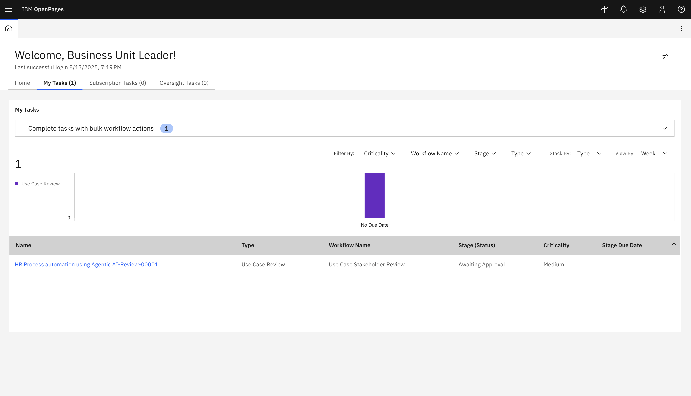

---

#### 2️⃣ Review Key Part

* **Use Case Assessment**
* **Risk Level**
* **Approval Status**

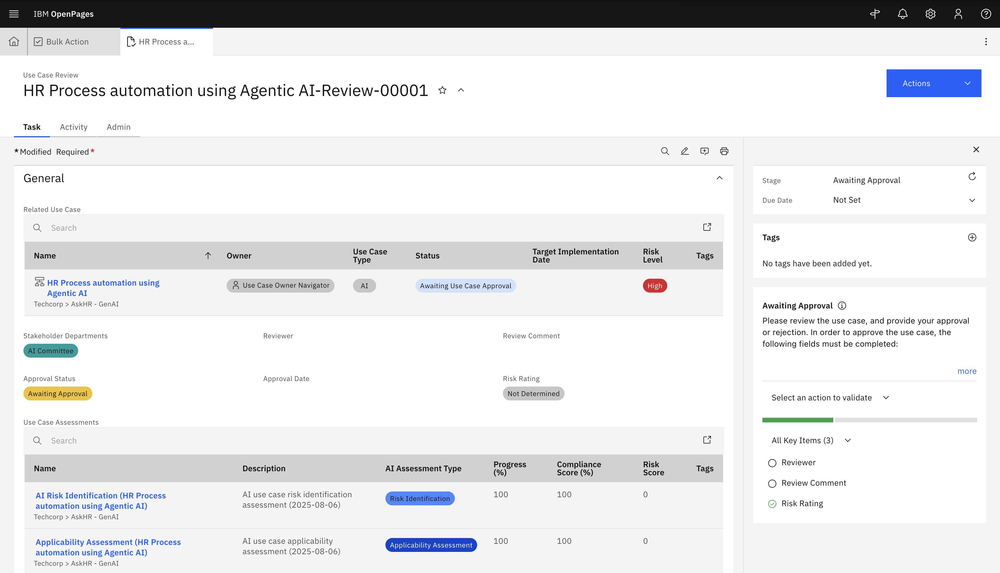

#### 4️⃣ Approve or Reject the Use case

Go to actions and :

| Action     | Instruction                               | Outcome                                   |
|------------|-------------------------------------------|--------------------------------------------|
| ✅ Approve | click `Actions` > `Approve for Development` | Finalizes the risk for downstream linkage |
| ❌ Reject  | click `Actions` > `Reject use case`        | Sends the risk back for revision          |

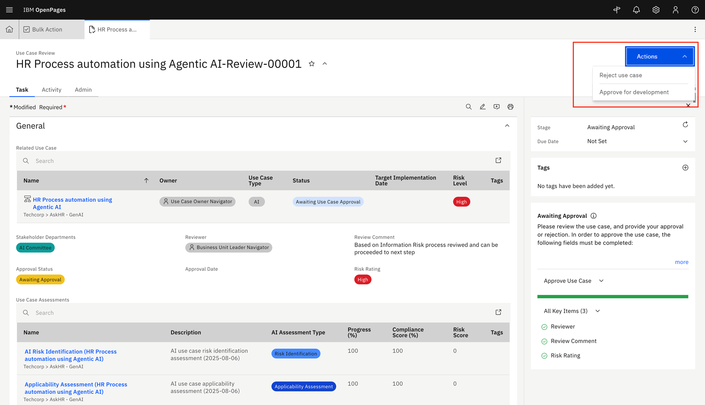
---

## 🎯 After You Submit

| If Approved                        | If Rejected                       |
| ---------------------------------- | --------------------------------- |
| Risk is now active                 | Sent back to Model Owner          |
| Can be linked to Controls & Issues | Requires updates and resubmission |

---

## 🎉 Thank You!

Your review ensures only **well-governed, risk-aligned initiatives** move forward—upholding business, regulatory, and operational integrity.

---

## 👩‍💼 3. Model Developer Responsibilities

As a Model Developer, your responsibilities focus on creating and evaluating Prompts and Agents for generative AI use cases. You will build and test these artifacts in the Prompt Lab and Agent Lab. Upon creation, a Factsheet is automatically generated and linked to Watsonx.governance.

You are responsible for completing any required details in the factsheet and submitting it for governance approval.

**🔐 Note:** Make sure you're logged in as Model Developer to access Prompt and Agent Labs.

#### Overview

These instructions focus on automating HR policy question/answering processes using IBM watsonx **AutoRAG** capabilities.

**Business Goal:** Automate question/answering process from HR policies using IBM watsonx **AutoRAG**, enabling faster, bias-free hiring while maintaining compliance in OpenPages.

#### 🧠 Agentic RAG Capabilities for HR Policy Q&A:

1. Ingest and index HR policy documents (PDFs, DOCX, web pages, internal knowledge bases)
2. Allow users to ask natural language questions about HR policies (e.g., leave, benefits, conduct, compliance)
3. Retrieve relevant policies using semantic search
4. Generate clear, accurate answers grounded in official HR documentation
5. Highlight source references to support transparency and traceability
6. Support multilingual queries and inclusive language understanding

> **Note:** The Agentic RAG model for this use case is **already created and deployed** in the pre-production environment.

---
#### Persona

**Model Developer:** Responsible for accessing the deployed Agentic RAG model, running evaluations, and integrating outputs into OpenPages.

---

#### 3. Step-by-Step OpenPages Flow

#### **Step 1 – Access the Deployed Agentic RAG Model**

The Agentic RAG model is already developed and deployed. To access it:

1. Log in to the **[IBM Cloud](https://cloud.ibm.com/login)** platform.

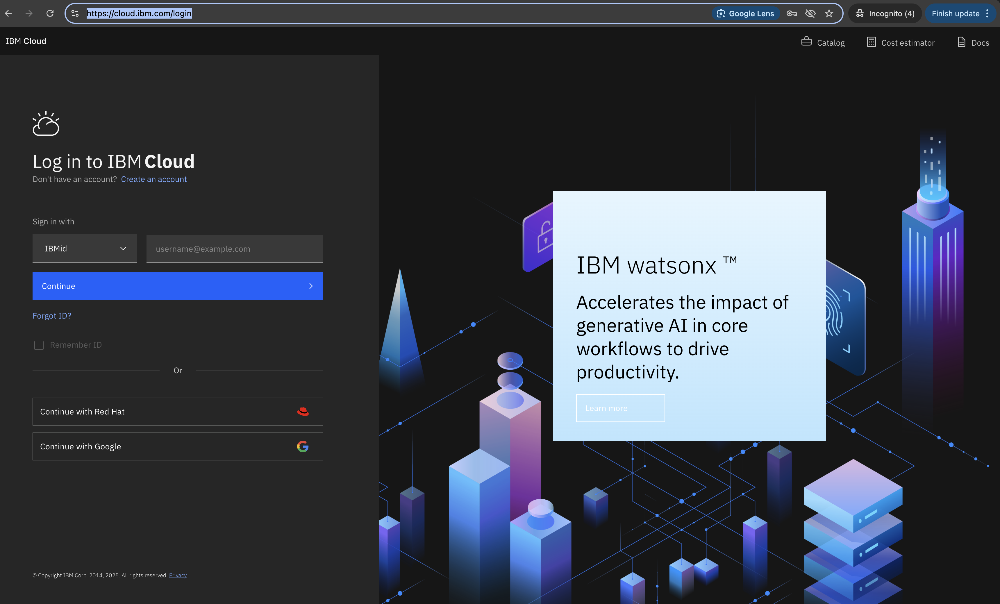

2. Open **hamburger menu → Resource List → watsonx.governance**
   
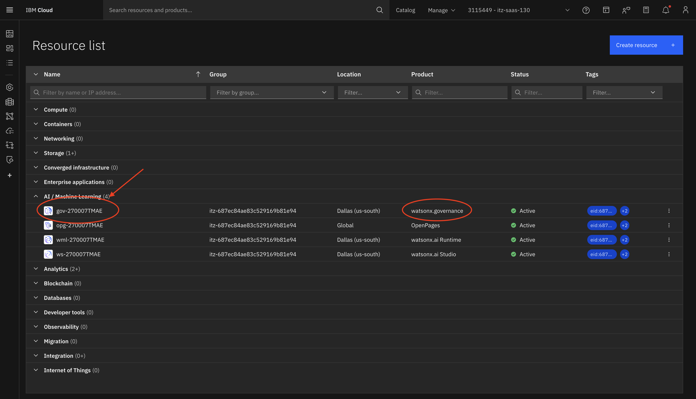

3. Click the **Launch in watsonx.governance** button — this navigates to:
   [https://dataplatform.cloud.ibm.com/wx/home?context=wx](https://dataplatform.cloud.ibm.com/wx/home?context=wx)
   

4. On the **watsonx Studio** homepage:
   
* Create a new project as explained in the steps linked here: [Steps for creating project](assets/instructor/create-project.md)
  
* After creating the project, go to the **Assets** tab and click on **New Asset**:
  

* Select **Working with data or models in Python or R notebooks** from the **All** option on the sidebar:
  

* Go to the **local file** tab and click **browse** to upload the notebook linked here as a local file: [Notebook](assets/agentic-rag.ipynb)
  
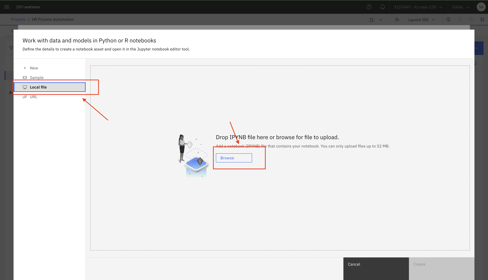

* Select the [Notebook](assets/agentic-rag.ipynb), download it locally, and upload it to the watsonx.ai runtime.
  

* After uploading, provide a name to the notebook and click the **Create** button:
  
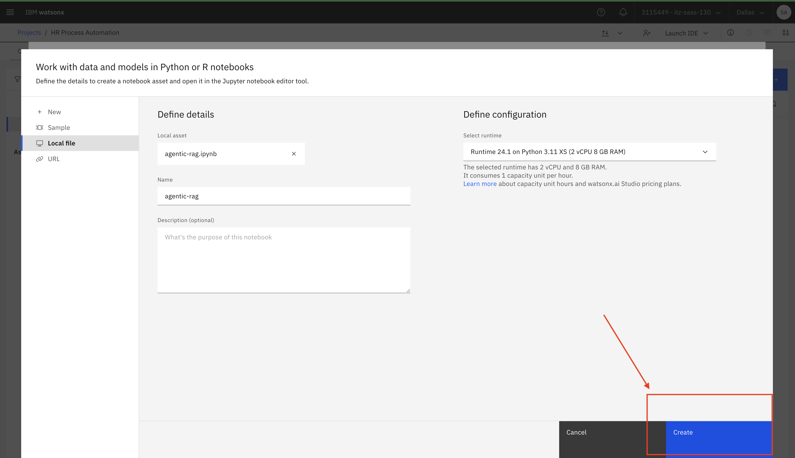

* The notebook will now be ready to run and **create a Detached Prompt Template for Agentic RAG** in the OpenScale dashboard UI

-> In this notebook:

- Use **watsonx_api_key** created initially [Create API key](assets/instructor/api_key_setup.md)
- Access **project_id** by navigating: hamburger menu → projects → view all projects → your project-> Manage tab -> copy project id.

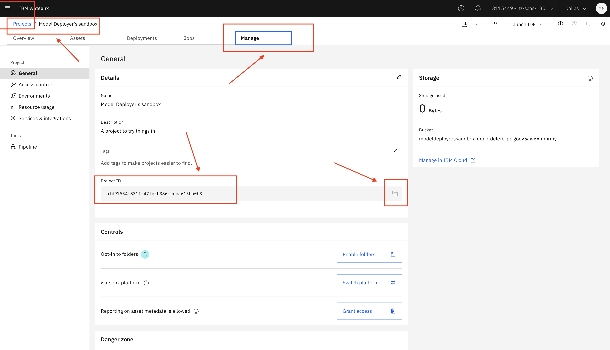
   
  
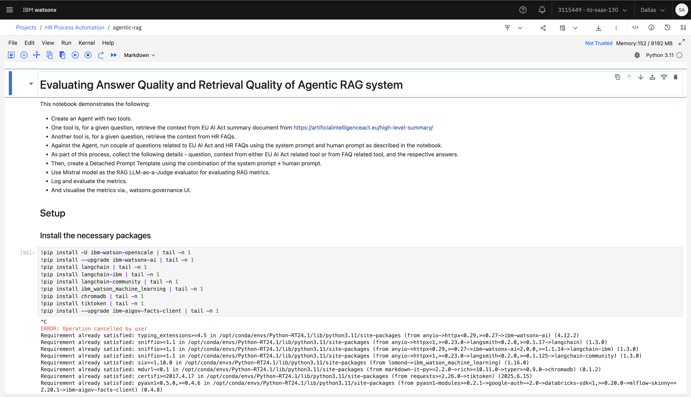

---

> **Note:** The Model Developer can use this Notebook for evaluation and integration.

---

#### **Step 2 – Run Notebook in watsonx.governance**

Run the above notebook and then visualize the results in **IBM watsonx Openscale** Dashboard:

#### Using the UI:

Navigate to the **Detached Prompt Template** asset within the project on **[Openscale](https://aiopenscale.cloud.ibm.com/aiopenscale/insights?nocache=true&bss_account=4b9fae855573451bb6e3bb27d9153c4a)** Dashboard:

#### **Step 3 – AI Factsheet View of Detached Prompt Template **

1. Go to dataplatform.cloud.ibm.com watsonx studio

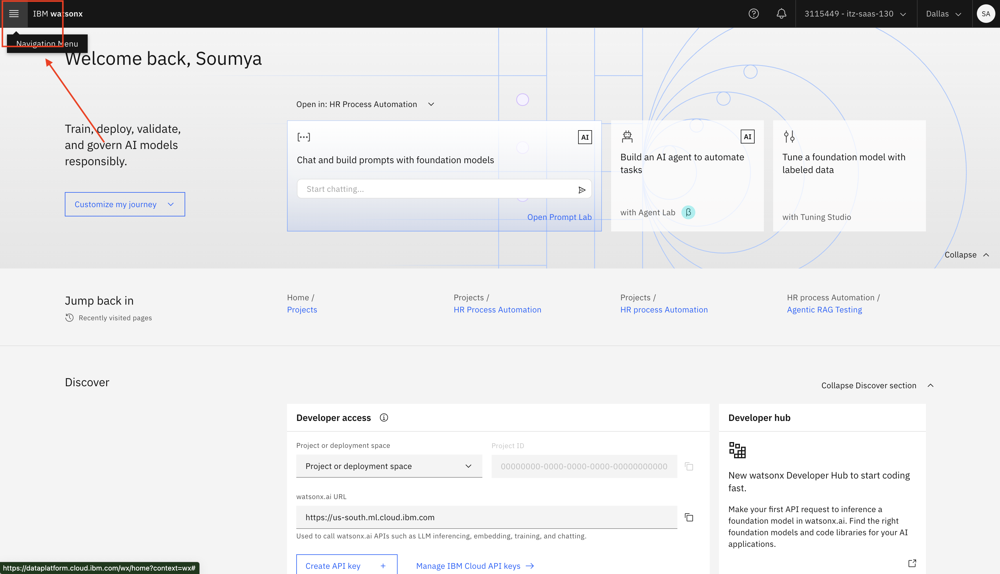

2. Navigate: hamburger menu → projects → view all projects → HR Process Automation (select this project)

   

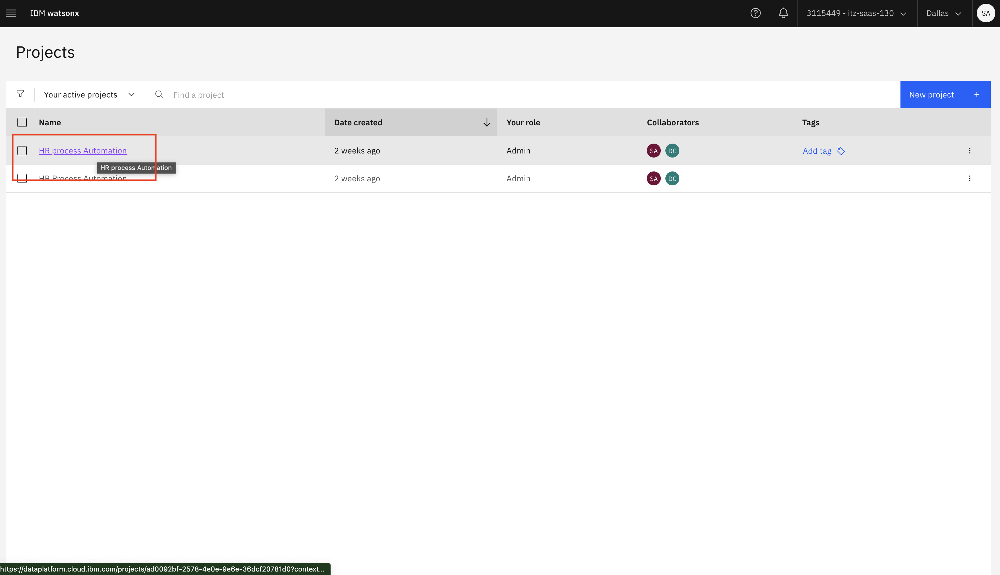

3. Inside this project, you will find **Detached prompt template** named **Agentic RAG** - select that

   

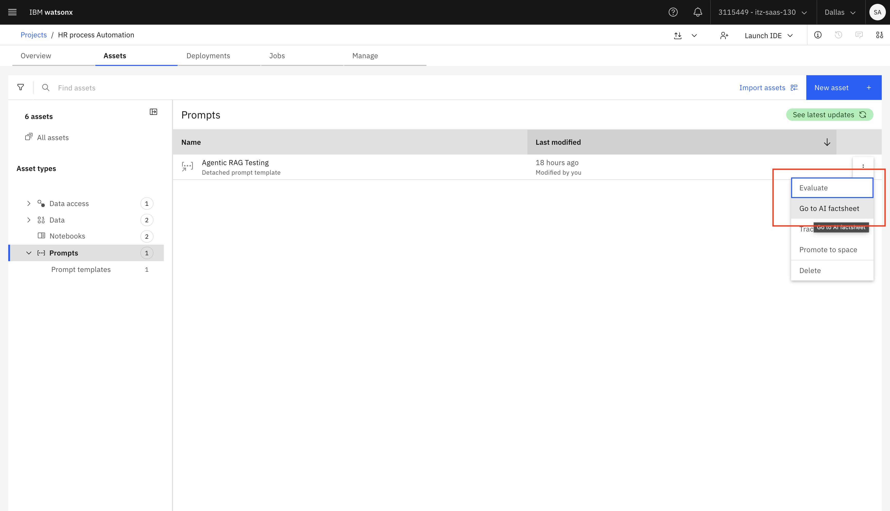  

4. After selecting, you will be onboarded to **AI Factsheet**

5. Now click on **Track in AI use case**  to associate asset to **AI Use case** click on **Go to AI Use cases** as project is not associated to **AI Use case** :

   
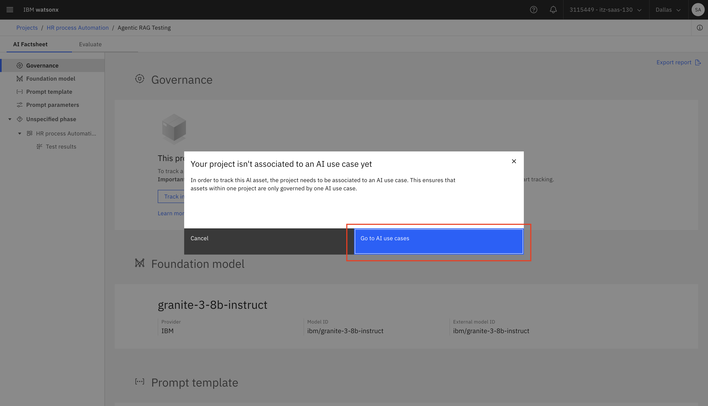

6. Select **AI Use case** created by **Use case owner** initially :

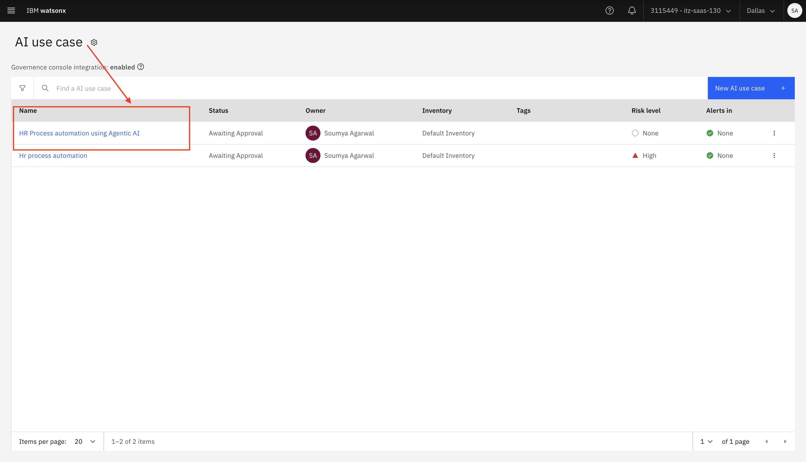

7. Go to **Associated workspaces** section and Select **Validation** phase and click on **Associate Workspace**:

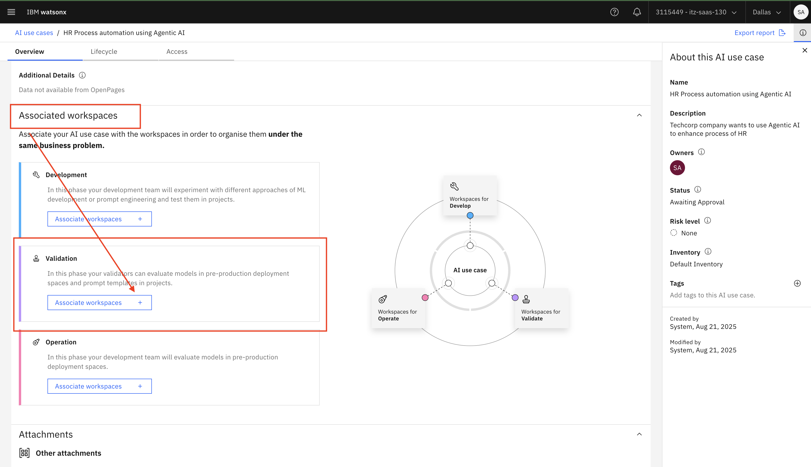

9. Here, Select **Project** created initially and Deployment space created  or if you have not created Click on **+New Space** and follow [Deployment Creation Steps](assets/instructor/deploy-project.md) these steps for creating deployment space for **Testing** Deployment stage. Click on Save:

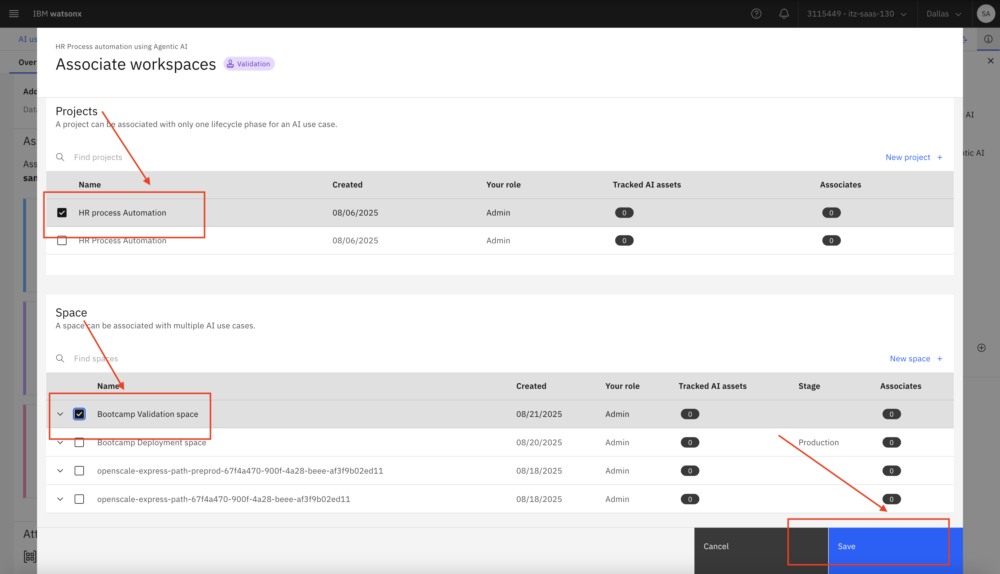

10. Now **AI Use case** is associated to **project** and **deployment space**.In **Associated Workspaces** Section Click on Arrow beside **your project** under **Validation** phase:

    
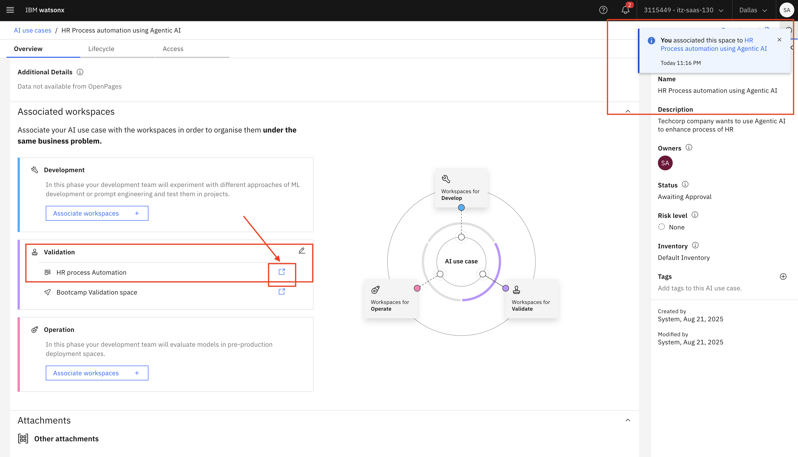

11. In project go to **Assets** tab select **Agentic RAG testing** asset and click on three dot then select **Go to AI factsheet**

    

12. Now **AI Use case** is getting tracked in **Validation** phase so Click on **Track in AI Use case**:

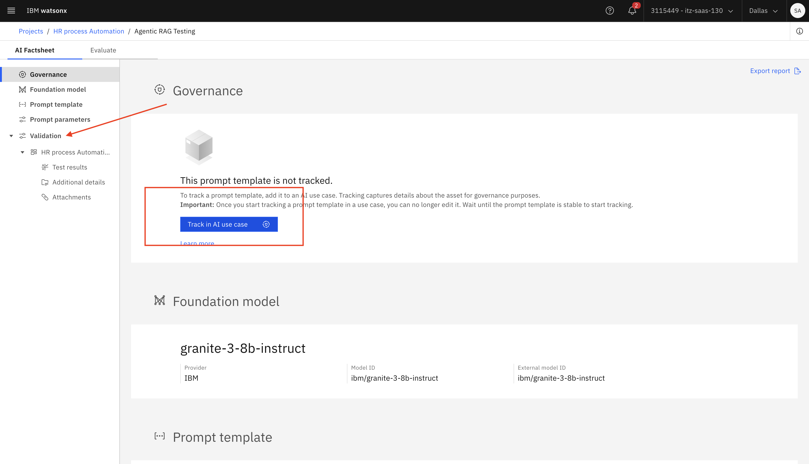

13. Select Approach set as **Default Approach** or click on **+New Approach** for defining one path for solving the goal of the use case. Click on **Next**:

14. Associate the **asset** with an existing model record or create a new model record in OpenPages. This will sync the tracked model facts between Model inventory and OpenPages.Click on **Next**.

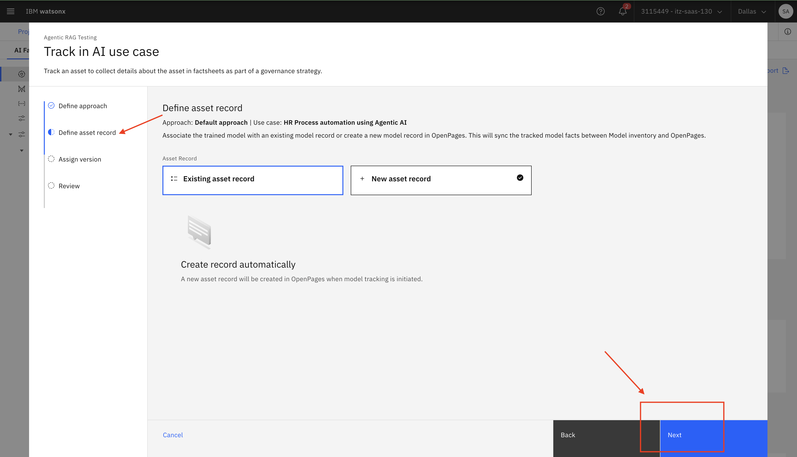

15. Choose the starting point for this approach(Experimental,Stable,Custom) any one of them for **version** tracking. Click on **Next**:

16. Review to make sure that your detached prompt template is stable before you track it in an **AI use case**. Click on **Track Asset**:

 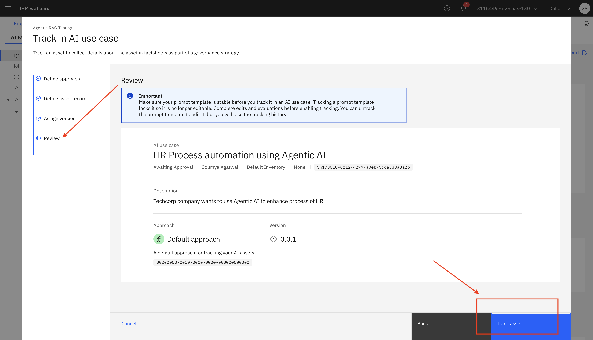   

Finally **Agentic RAG** getting tracked in **AI Use case**. Click on **Agentic RAG Testing** under asset record to view it in **Governance Console**

 

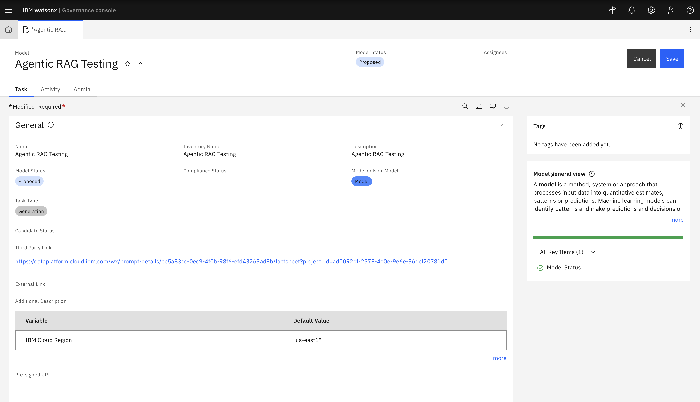 

17.Now Go to [Model Lifecycle part to start process for validation](http://github.ibm.com/skol/ai-governance-client-bootcamp/edit/mainassets/tasks/Model%20lifecycle)

> [!Note]
> Model Developer has developed **Agentic RAG Detached prompt template** and Also onboarded it to **AI Use case**

---

#### Prerequisites

- IBM Cloud account with access to watsonx.governance
- Access to the pre-deployed Agentic RAG model
- Permissions to create and manage projects in Watsonx Studio

#### Resources

- [IBM Cloud Platform](https://cloud.ibm.com/login)
- [Project Creation Steps](assets/instructor/create-project.md)
- [Create API key](assets/instructor/api_key_setup.md)
- [Agentic RAG Notebook](assets/agentic-rag.ipynb)

## 👩‍💼 4. Model Validator Responsibilities

As a **Model Validator**, you are responsible for monitoring and validating the AI model’s performance and fairness metrics on the **IBM Watson OpenScale** dashboard. You will review alerts related to fairness, quality, drift, and explanations to ensure the model meets governance standards.

<!--
### Key Actions:

* Log in as **Model Validator / AI Engineer**
* Navigate via **Hamburger Menu → Instances → openscale-defaultinstance**
* Open **IBM Watson OpenScale** by clicking **Open** (top right)
* Review model performance metrics for fairness, quality, and drift (focus on triggered alerts and violations; raw scores are not the primary concern)
* Evaluate the model by uploading test data provided by your instructor:

  * Click **Actions → Evaluate now**
  * Upload a CSV file containing input and expected output (ground truth)
  * Wait for evaluation to complete
* Submit feedback or observations for governance reporting

### Notes on Evaluation Dataset:

* Max size: 8 MB
* Record limits: Minimum 10, Maximum 1000
* Dataset provided by instructor
-->

> ⚠️ **Note:** Log in with the **Model Validator** role before accessing validation tools.

---

#### 🔑 Accessing Detached RAG Prompt Validation Tools

1. Log in to IBM Cloud.
2. From the **Hamburger Menu (☰)**, navigate to **Instances**.
3. Select **openscale-defaultinstance**.
4. In the IBM Watson OpenScale dashboard, click **Open** (top right corner).

---

#### 🎯 Validation Responsibilities

As a Model Validator, your primary role is to ensure **detached RAG prompts** meet performance, fairness, and quality standards, focusing on:

* **Fairness**
  Monitor and validate fairness metrics to detect bias against sensitive groups.

* **Alerts and Violations**
  Review alerts triggered by the system to investigate potential issues.

* **Quality Metrics**
  Assess overall **detached RAG prompt quality**, including precision, recall, and other key indicators.

* **Drift Detection**
  Track data, output, and prediction drift to ensure **detached RAG prompt stability** over time.

* **Global Explanation**
  Understand feature importance to validate **detached RAG prompt decision rationale**.

* **detached RAG prompt Performance Evaluation**
  Upload test datasets to evaluate **prompt outputs** against ground truth.

---

#### 🔍 Validation Areas

#### Fairness Validation

* Evaluate alerts related to fairness metrics (e.g., Disparate Impact, Statistical Parity Difference).
* Check alerts for sensitive groups (e.g., gender-based fairness).
* Investigate any violations flagged.

#### Quality and Alerts

* Review alerts on quality metrics such as Precision, Recall, Accuracy, F1-Measure.
* Identify and address violations affecting **detached RAG prompt performance**.

#### Drift Monitoring

* Observe drift alerts indicating changes in input data or **detached RAG prompt outputs**.
* Take action if drift impacts reliability.

#### Generative AI Quality – Retrieval Augmented Generation (RAG)

* Assess alerts on answer quality and retrieval accuracy.
* Monitor content analysis metrics and data safety concerns.
* Investigate alerts indicating quality or safety issues in generated responses.
  
##First Task:(In Validation Phase) Platform : [Openscale](https://aiopenscale.cloud.ibm.com/)

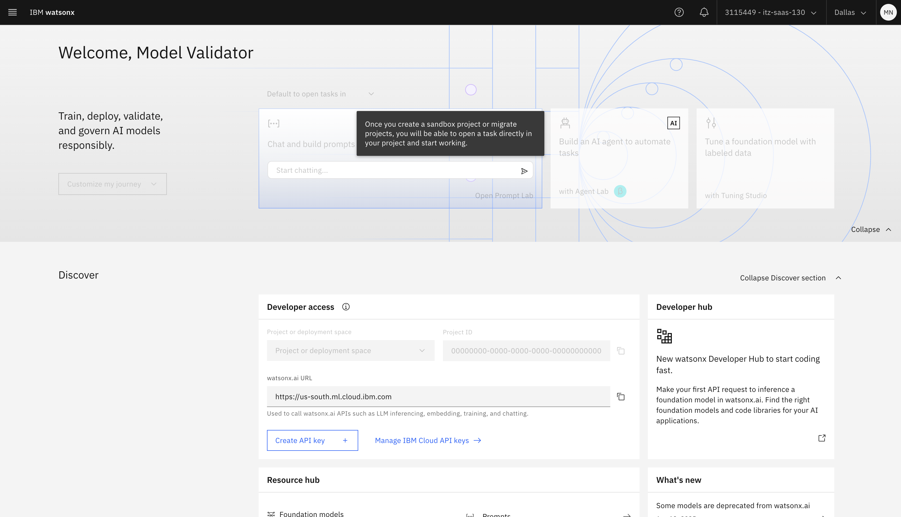

#### Detached RAG prompt Performance Evaluation Using Test Data

1. In the OpenScale dashboard, click **Actions** > **Evaluate Now**.

   
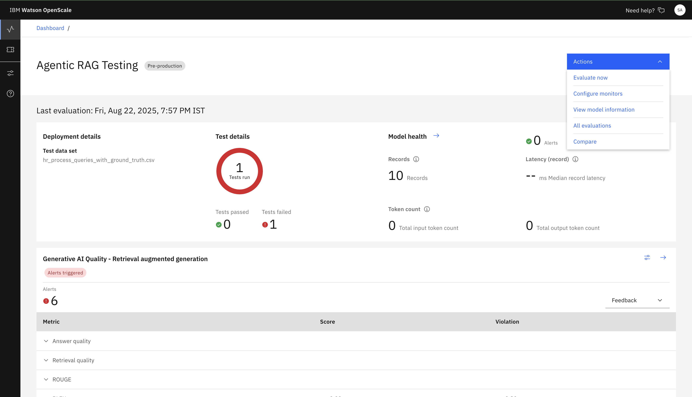

2. Upload a CSV test dataset provided by your instructor that includes input features and expected output (ground truth).

   * Optional: Include **detached RAG prompt output** to skip extra transactions.
   * File constraints: Max size 8 MB, min 10 records, max 1000 records.

  
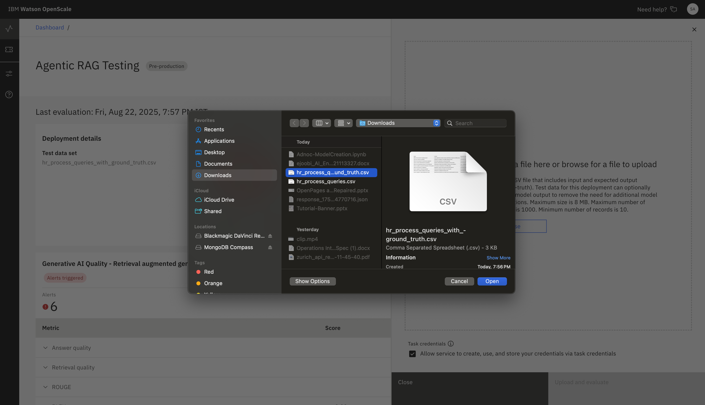 

3. Map all required fields from your uploaded csv.Click **Upload and Evaluate**.

.  

4. Wait for evaluation to complete and review the results for accuracy and other metrics.

   
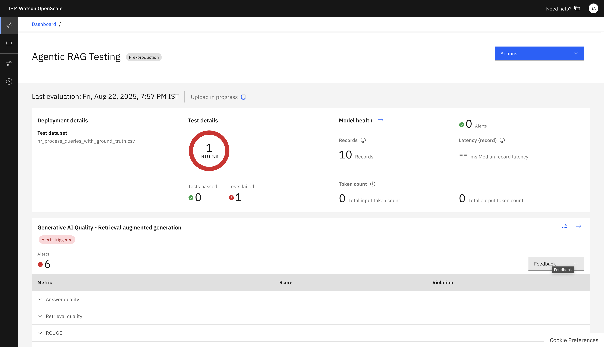 

#### Second Task:(In Validation Phase) Platform:[Governance Console](https://a608fa19-3b7.us-east-1.aws.openpages.ibm.com/)


1.At home page page go to **My Tasks** Select **Agentic RAG Testing** detached prompt that is send by Model Developer for validation.


2.Review all fields and metrics added for asset and also add other mandatory fields.


3.Click on **New Review** under Model Review section.


4.Fill all required fields as shown in Image below and click **Save**


5.After that Review your Model Review and go back to asset.


6.Click Save.


7.Go to Actions and **Submit for final approval**.


---

#### ✅ Summary

Your validation work helps ensure that **detached RAG prompts**:

* Operate fairly without bias.
* Maintain high-quality performance.
* Adapt safely to changing data distributions.
* Generate reliable and compliant outputs.
* Meet expected performance benchmarks via test dataset evaluation.

---

#### 🎉 Great Job!

By performing thorough validation, including test data evaluation, you support trustworthy, transparent, and ethical AI deployments!

---

  
## 👩‍💼 5. AIOps Engineer Responsibilities

As a **AIOps Engineer**, you are responsible for Deploying the AI use case/model on **IBM Watsonx Governance** .

<!--
### 🔍  Key Actions

1. Log in to **IBM Cloud**.  
2. From the **Hamburger Menu (☰)**, navigate to **Instances → openscale-defaultinstance**.  
3. Click **Open** (top right) to access **IBM Watson OpenScale**.  
4. Review model **performance metrics** for fairness, quality, and drift.  
   - Focus on **alerts and violations**; raw scores are secondary.  
5. Evaluate the model with **test data**:  
   - Click **Actions → Evaluate Now**  
   - Upload CSV file with input features and expected output  
   - Wait for evaluation to complete  
6. Track the model and submit feedback:  
   - Click **AI Factsheet → Track in AI Use Case**

-->

#### 🧑‍🔬 AIOps Engineer – Deploy and Track Model in Production

> ⚠️ **Note:** Log in with the **AIOps Engineer** or **AI Engineer** role before accessing deployment tools.

---

#### 🔑 Accessing Project Deployment Tools

1. Log in to **IBM Cloud**.
   


 
2. From the **Hamburger Menu (☰)**, navigate to **Projects**.

3. Click **View All Projects**.
   


4. Select **HR Process Automation Project**.  

---

#### 🎯 Deployment Responsibilities

As a **Model Deployer**, your primary responsibilities include:

- **Asset Management**  
  Promote and manage AI assets (prompts, models) to the correct deployment space.  

- **Deployment**  
  Configure and launch assets in production with proper naming and optional descriptions.  

- **Monitoring**  
  Track deployed AI in the **AI Use Case** view to ensure correct operation and performance.  

- **Documentation**  
  Review **AI Factsheets** to validate asset metadata, lineage, and compliance.  

---

#### 🔍 Deployment Steps

#### 1️⃣ Promote Asset to Deployment Space

1. Navigate to **Assets** → **Asset Types** → **Prompts** -> Locate **Agentic RAG Testing Detached Prompt**.

   


  
2. Click the **3-dot menu** on the asset → select **Promote to Space**.

   


     
3. Choose the **space you created initially** or you can create new space as **Production** deployment stage. - [Steps for creating Deployment Space](assets/instructor/deploy-project.md)
   


   
4. Click **Promote**.

   


    
5. Confirm the asset is now **promoted to the deployment space**.
   

  

---

#### 2️⃣ Deploy Asset

1. In the deployment space, click the **3-dot menu** on the promoted asset → select **Deploy**.

  

2. Enter a **name** for the deployment, optionally, add a **description**.

  

  
 
3. Click **Deploy**.

  

 
4. Click on Create.Your **Agentic RAG asset** is now **running in production**.

  
  

---

#### 3️⃣ Track and Monitor Deployment

1. Click the **AI Factsheet** next to the **Deployment** tab.
   

  

2. Review **asset metadata**, **performance**, and **compliance information**.
    

 

3. Click **Track in AI Use Case** to monitor the deployed AI in context.
     

 

---

#### ✅ Summary

Following these steps ensures:

- AI assets are correctly promoted to the proper deployment space.  
- Deployed models are operational and accessible in production.  
- Asset metadata and performance are transparent through **AI Factsheets**.  
- You can monitor and track AI effectively in the **AI Use Case** view.  

---

#### Prerequisites

- IBM Cloud account with access to Watsonx.Governance
- Access to the pre-deployed Agentic RAG model
- Permissions to create and manage projects in Watsonx Studio
  
---

#### Resources

- [IBM Cloud Platform](https://cloud.ibm.com/login)
- [Steps for creating Deployment Space](assets/instructor/deploy-project.md)

---

By deploying and tracking your **Agentic RAG prompt**, you ensure **reliable, compliant, and production-ready AI services** for HR process automation!  

<!--
## 📋 Summary of Stakeholder Actions

| Stakeholder Role            | Key Responsibilities                                              | Reference Guide                                                                                                                                                                                                                                                                                                                                            |
| --------------------------- | ----------------------------------------------------------------- | ---------------------------------------------------------------------------------------------------------------------------------------------------------------------------------------------------------------------------------------------------------------------------------------------------------------------------------------------------------- |
| **Model Owner**             | - Create business entity - Define use case - Submit risk    | - [Create Business Entity](https://github.ibm.com/skol/ai-governance-client-bootcamp/blob/mainassets/tasks/business_entity_creation_model_owner.md) - [Submit and Define Use Case](https://github.ibm.com/skol/ai-governance-client-bootcamp/blob/mainassets/tasks/usecase_creation_model_owner.md) |
| **Risk Compliance Officer** | - Review and assess risk for compliance                           | - [Review and Assess Risk](https://github.ibm.com/skol/ai-governance-client-bootcamp/blob/mainassets/tasks/risk_review_rco.md)                                                                                                                                                                                                   |
| **Business Unit Leader**    | - Endorse or reject risk based on alignment with strategy         | - [Stakeholder Risk Endorsement](https://github.ibm.com/skol/ai-governance-client-bootcamp/blob/mainassets/tasks/risk_endorsement_BUL.md)                                                                                                                                                                                        |
| **Model Developer**         | - Create and evaluate prompts and agents for GenAI use cases      | - [Model Developer Tasks and Guidelines](https://github.ibm.com/skol/ai-governance-client-bootcamp/blob/mainassets/tasks/model_developer_tasks.md)                                                                                                                                                                               |
| **Model Validator**         | - Validate model performance and fairness via OpenScale dashboard | - [Model Validator Tasks and Evaluation Guide](https://github.ibm.com/skol/ai-governance-client-bootcamp/blob/mainassets/tasks/model_validator_tasks.md)                                                                                                                                                                         |
-->

## 👩‍💼 6. 🔍 Operations Team & Model Developer Responsibilities

As a **AIOps Engineer** or **Model Developer**, you are responsible for Managing and monitoring the AI use case/model on **IBM Watsonx Governance** .

> ⚠️ **Note:** Log in with the **Operations & Risk Team** role before accessing monitoring and governance tools in Watsonx Governance.

---

#### 🧑‍💻 Model Developer – AI Asset Deployment & Testing

> ⚠️ **Note:** Log in with the **Model Developer** role before accessing project assets, promoting prompts, and testing AI models.

**Who:** Operations & Model Developer Team 

>[!Note]
> Now after **AIOps Engineer** will complete the deployment of asset in **Production Space** when get approval from **Buisness Unit Leader** he will involve Model developer in managing and monitoring **Agentic RAG Detached prompt** asset in Production.
> After completing [Deployer_tasks](https://ca-tor.git.cloud.ibm.com/honda/honda-agentic-ai-bootcamp-2025/-/tree/main/Lab%208%20-%20AI%20Governance%20with%20OpenPages#-aiops-engineer--deploy-and-track-model-in-production) AIOps engineer continue tracking deployed asset in AI Use case along with **Model Developer** in **Governance Console** by following below steps:
---

#### Key Actions in Watsonx Governance

#### Track in AI Use Case

1. Now click on **Track in AI use case**  to associate asset to **AI Use case** click on **Go to AI Use cases** as project is not associated to **AI Use case** :

   

2. Select **AI Use case** created by **Use case owner** initially :

3. Go to **Associated workspaces** section and Select **Operation** phase and click on **Associate Workspace**:

4. Here, Select  Deployment space created initially or if you have not created Click on **+New Space** and follow [Deployment Creation Steps](assets/instructor/deploy-project.md) these steps for creating deployment space for **Production** Deployment stage. Click on Save:

5. Now **AI Use case** is associated to **project** and **deployment space**.In **Associated Workspaces** Section Click on Arrow beside **your project** under **Operation** phase:

    

#### Evaluate prompt template in **Production** Phase:

1. In project go to **Deployments** tab Click on **Agentic RAG Production** your deployment name:

    

2. In Evaluation tab click on **Activate** to evaluate prompt template in **Production** phase:

   

3. Choose the evaluation dimensions and select the test data:

  

---

#### Prerequisites

- IBM Cloud account with access to Watsonx.Governance
- Access to the pre-deployed Agentic RAG model
- Permissions to create and manage projects in Watsonx Studio
  
---

#### Resources

- [IBM Cloud Platform](https://cloud.ibm.com/login)
- [Steps for creating Deployment Space](assets/instructor/deploy-project.md)

---

#### ✅ Summary

- Monitoring in **Watsonx Governance** ensures AI models in production remain fair, high-quality, and reliable.  
- Alerts provide proactive oversight for risk and compliance.  
- Operations & Risk teams maintain transparency and governance of AI deployments.  

  
#### 🎉 Congratulations!

You've helped ensure this Agentic AI use case adheres to ethical AI practices by:

* Validating risk levels
* Confirming regulatory and internal compliance
* Approving only well-governed use cases
* Ensuring model fairness and quality through continuous validation

> 🛡️ Governance is not a one-time check — it’s a continuous loop of accountability and alignment.

<!--
Please find the step-by-step instructions [here](assets/hands_on_lab_askhr_v2.md) on how you can implement this use case.
-->
